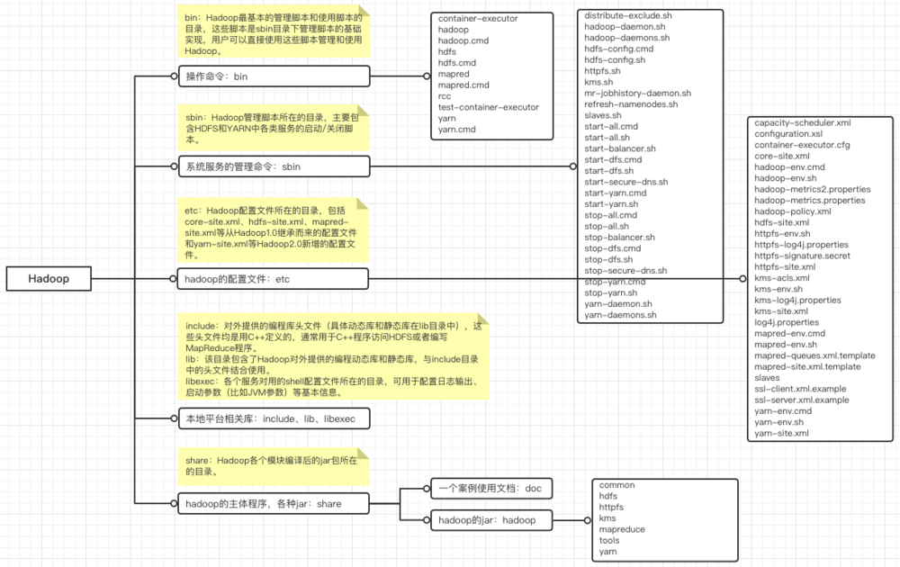
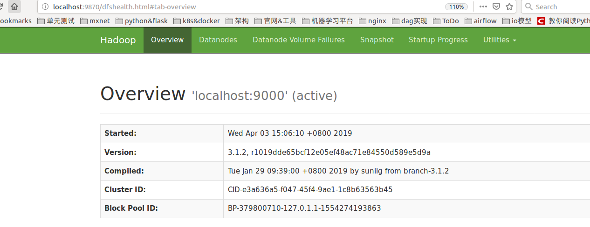
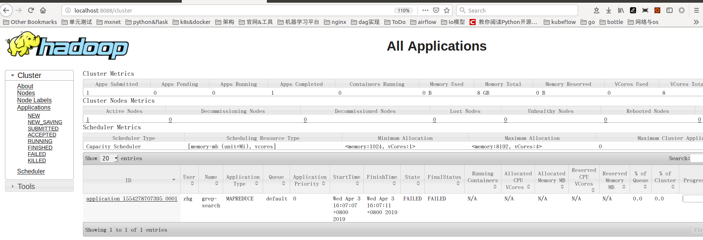

## 单机学习环境部署(pc机 ubuntu 16.04)
   1. 安装java
   java环境变量设置： 虽然/usr/bin目录下也有java,但环境变量设置另外目录下的。 最好在/etc/profile设置全局的，
   export JAVA_HOME=/usr/lib/jvm/java-1.8.0-openjdk-amd64/
   export PATH=$JAVA_HOME/bin:$PATH
   2. 安装Hadoop
   从官方下载二进制包，解压之后bin/hadoop即可运行。 http://hadoop.apache.org/docs/stable/hadoop-project-dist/hadoop-common/SingleCluster.html
   使用举例：在官方目录下将配置的xml文件拷贝到input目录作为输入，然后使用正则过滤，输出放在output目录。 这个例子没有启动hdfs,没有启动yarn,
   只是启动单一任务模型mapreduce,用于调试代码对不对。
   
           mkdir input
           cp etc/hadoop/*.xml input
           bin/hadoop jar share/hadoop/mapreduce/hadoop-mapreduce-examples-3.1.2.jar grep input output 'dfs[a-z.]+'
           cat output/*
           
   主要的目录结构：
   
   

   
   3. 单机环境的hbase安装  过程参考https://www.yiibai.com/hbase/hbase_installation.html
   软件下载 http://hbase.apache.org/downloads.html，　解压到/usr/local目录下，目录重命名为Hbase,
   
           vi /usr/local/Hbase/conf/hbase-env.sh ,加入如下配置
           export JAVA_HOME=${目录}
           
           vi /usr/local/Hbase/conf/ hbase-site.xml, 加入如下配置
           <configuration>
           //Here you have to set the path where you want HBase to store its files.
           <property>
           <name>hbase.rootdir</name>
           <value>file:/home/zhg/HBase/HFiles</value>
           </property>
           //Here you have to set the path where you want HBase to store its built
           in zookeeper files.
           <property>
           <name>hbase.zookeeper.property.dataDir</name>
           <value>/home/zhg/zookeeper</value>
           </property>
           </configuration>
   
   启动hbase
   
        /usr/local/HBase/bin/start-hbase.sh
        running master, logging to /usr/local/Hbase/bin/../logs/hbase-zhg-master-zhg.out
   
   shell测试hbase： 默认端口为60000
   
       /usr/local/HBase/bin/hbase shell
       list
       create 't1',{NAME => 'f1', VERSIONS => 2}
       describe 't1'
       scan 't1',{LIMIT=>5}
   
   web端地址： http://localhost:16010/
   停止hbase:  /usr/local/HBase/bin/stop-hbase.sh
   
   4. Hadoop伪分布式
   伪分布式即副本数为1，不启动yarn,要启动hdfs需要开启ssh服务并设置免密登录,如果设置了副本还需要用rsync进行同步
   
          sudo apt-get install ssh
          sudo apt-get install rsync
          # ssh-keygen -t rsa -P '' -f ~/.ssh/id_rsa 如果已经生成了秘钥对不用在生成
          cat ~/.ssh/id_rsa.pub >> ~/.ssh/authorized_keys
          chmod 0600 ~/.ssh/authorized_keys
          ssh localhost    # 能够直接登录说明成功
   
   配置文件配置
   etc/hadoop/core-site.xml:
   
       <configuration>
           <property>
               <name>fs.defaultFS</name>
               <value>hdfs://localhost:9000</value>
           </property>
       </configuration>
   
   etc/hadoop/hdfs-site.xml:
   
       <configuration>
           <property>
               <name>dfs.replication</name>
               <value>1</value>
           </property>
       </configuration>
       
   mapreduce不是服务，只是一个库，所以不需要启动。hdfs和yarn是相互独立的服务，可以单独启动，也可以使用hadoop的脚本自动化启动。
   启动hdfs:启动成功后访问http://localhost:9870通过namenode服务查看集群状态，不是50070端口
   
       bin/hdfs namenode -format
       sbin/start-dfs.sh  
       # 启动的时候可能报JAVA_HOME找不到，需要在etc/hadoop/hadoop-env.sh中也export JAVA_HOME
   
   
   
   在伪分布式环境执行上面的mr任务，bin/hdfs默认操作/usr/<username>目录下的目录，所以
   
       bin/hdfs dfs -mkdir /user
       bin/hdfs dfs -mkdir /user/zhg
       bin/hdfs dfs -put etc/hadoop input
       bin/hadoop jar share/hadoop/mapreduce/hadoop-mapreduce-examples-3.1.2.jar grep input output 'dfs[a-z.]+'
       bin/hdfs dfs -get output output
       cat output/*
       bin/hdfs dfs -cat output/*  # 不会在终端显示
       
       sbin/stop-dfs.sh  # 测试完之后停调hdfs服务
       
   
   整个相关的服务启动方法有三种：
   
   (1)方法一：分别启动
   
   启动hdfs的脚本在sbin/hadoop-daemon.sh中，
   
       sbin/hadoop-daemon.sh start namenode
       sbin/hadoop-daemon.sh start datanode
       sbin/hadoop-daemon.sh start secondarynamenode
   
   
   启动yarn的脚本在sbin/yarn-daemon.sh中
   
       sbin/yarn-daemon.sh start resourcemanager
       sbin/yarn-daemon.sh start nodemanager
   
   
   (2)方法二：自动化启动启动
   
       sbin/start-dfs.sh
       sbin/start-yarn.sh
   
   (3)方法三：同时启动hdfs和yarn
   
       sbin/start-all.sh
   
   
   5. 在单机伪分布式的基础上启动yarn
   在已有的伪分布式的基础上继续操作,环境变量设置export HADOOP_HOME={安装目录}
   
   配置文件：如果只按照官方配置mapreduce.framework.name而不配其他，跑任务的时候会报错，
   配置文件解析不对的话start-yarn.sh会运行失败，看对应的日志可以找到原因
   etc/hadoop/mapred-site.xml
   
       <configuration>
           <property>
               <name>mapreduce.framework.name</name>
               <value>yarn</value>
           </property>
           <property>
               <name>yarn.app.mapreduce.am.env</name>
               <value>HADOOP_MAPRED_HOME=${HADOOP_HOME}</value>
           </property>
           <property>
               <name>mapreduce.map.env</name>
               <value>HADOOP_MAPRED_HOME=${HADOOP_HOME}</value>
           </property>
           <property>
               <name>mapreduce.reduce.env</name>
               <value>HADOOP_MAPRED_HOME=${HADOOP_HOME}</value>
           </property>
       </configuration>
    
   etc/hadoop/yarn-site.xml
   
       <configuration>
           <property>
               <name>yarn.nodemanager.aux-services</name>
               <value>mapreduce_shuffle</value>
           </property>
       </configuration>
   
   启动yarn: sbin/start-yarn.sh, web端访问 http://localhost:8088
   
   
   仍然执行如下任务，此时任务会基于yarn来调度，会出现虚拟内存超的情况，不影响最终的结果，因为失败的task会重启。
   执行完之后可在web端查看提交的任务以及完成的任务等。
   bin/hadoop jar share/hadoop/mapreduce/hadoop-mapreduce-examples-3.1.2.jar grep input output 'dfs[a-z.]+'
   
   
   
## python操作
   hbase本身不提供Python sdk，需要启动thrift服务转发.
   安装thrift依赖：sudo apt-get install automake bison flex g++ git libboost1.55 libevent-dev libssl-dev libtool make pkg-config
   系统如果已经有了这些依赖可以直接启动thrift.jps可以查看系统启动的java进程
   /usr/local/Hbase/bin/hbase-daemon.sh start thrift,默认端口为9090。
   python安装包，只支持Python2，https://www.cnblogs.com/junle/p/7611540.html
   
       sudo pip install thrift
       sudo pip install hbase-thrift
   