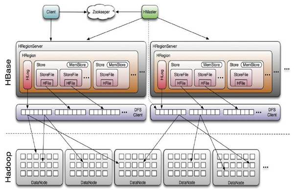

## hbase介绍
  hbase是nosql一种，底层是k-v存储实现的列式数据库，原生不支持sql语句，需要转换。mysql中空字段是要占据存储空间的，
  因为要先定义好schema，并且按行存储，一行的数据存储在一起。而hbase将属于同一列簇的存储在一起。这种存储方式使得hbase方便用于稀疏数据的存储，
  空字段不占空间，以及能够很好的拓展到上百万列，查询某一列不需要全表扫描。查询一行的数据也比较快，因为属于同一个列簇的存放在一起，
  hbase不推荐使用多个列簇。而mysql中的列一多就会影响性能，往往需要分表，然后通过联表查询。

  hbase应用场景：hbase是大数据组件之一，是在数据量大的时候也不慢，但是数据量少的时候并不是特别快。支持百万级别高并发写入，因为直接与client端通信。
  hbase不支持事务，适用于OLAP场景，而mysql等适用OLTP场景。

## hbase原理与架构
   架构图：
   
   
   其中的hmaster节点不同于hdfs中的namenode，不需要hmaster提供元数据信息，元数据存储在zk里面.hmaster主要是维护regionserver.
   hbase底层存储用到的hdfs,hdfs存储小文件效率不高，以及不支持读写，支持追加。所以hbase的修改删除都是基于追加的方式，旧的数据仍然会在，并指定一个版本或timestamp，
   取的时候默认取最新的数据。
    
   Region是hbase在rowkey上的切分，每个Region都可以通过startKey和endKey来确定rowkey的范围，一个HRegionServer上可能会有多个Region。
   说数据是根据rowkey和一定的哈希规则，分散到不同的Region上面
   
   hbase会先把数据存到内存，内存满了之后刷写到磁盘，然后再定期对小文件合并为大文件。

   hbase写入流程： HMaster会对拆分后的Region重新分配RegionServer，这是HMaster的负载均衡策略
   
         1、hbase client要写输入了，先从zookeeper中拿到meta表信息，根据数据的rowkey找到应该往哪个RegionServer写
         
         2、然后hbase会将数据写入对应RegionServer的内存MemStore中，同时记录操作日志WAL
         
         3、当MemStore超过一定阈值，就会将内存MemStore中的数据刷写到硬盘上，形成StoreFile
         
         4、在触发了一定条件的时候，小的StoreFile会进行合并，变成大的StoreFile，有利于hdfs存储

   hbase读取流程：
   
       1、hbase client要读数据了，先从zookeeper中拿到meta表信息，根据要查的rowkey找到对应的数据在哪些RegionServer上
       
       2、分别在这些RegionServer上根据列簇进行StoreFile和MemStore的查找，得到很多key-value结构的数据
       
       3、根据数据的版本找到最新数据进行返回

   hbase内部使用LSM三层模型进行存储，数据先写到内存MemStore中，内存达到一定阈值再刷写到硬盘StoreFile中，再满足一定条件时，小的StoreFile会合并为大的StoreFile

## hbase使用

   rowkey设计：简短，hbase的查询通过对rowkey建索引实现，所以把要查询的字段设置在rowkey中。 另外可以对rowkey设置filter。
   rowkey设计的另一个原则，就是散列性，rowkey的头几个字母，最好不要是一样的，不然会分布在同一个HRegionServer上面，导致这个HRegionServer的负载非常高，
   一般可以根据一定规则算一个数据的摘要，比如md5，把md5的头几位拼在rowkey的前面。
   
   列簇的设计：列簇是在建表的时候定义好，最多两个，列可以随时添加

hbase不支持join，因为hbase支持的列数足够大，足够在一个表里面存储所有的信息，不需要拆分。Phoenix帮助Hbase提供了SQL语法的支持，使难用的Hbase变得简单易用。

## zk的作用
zk在hbase中最大的功能是检测某个节点是否宕机， 检测的方式是每个节点上线时都会向zk注册，建立一个session，如果机器宕机，这个session就会过期。
HMaster主要维护系统表-ROOT-.META.(该表记录regionserver和region对应信息)。hmaster启动时候会将hbase 系统表-ROOT- 加载到 zookeeper cluster，
hbase regionserver则用于多个/单个region维护。region则对应为hbase数据表的表分区数据维护

参考：
 
    https://mp.weixin.qq.com/s/r_ouxFJ4FajyDl835iEcBQ
    <hbase 不睡觉书>
    

## hbase和es结合
hbase是海量kv数据库，es本质也是个数据库，偏搜索，可以将两者结合起来解决海量数据存储与查询的问题，具体数据存在hbase，es里只存在hbase查询的索引。
hbase本身不支持二级索引，一般都是hbase+solr/es或者hbase集成Phoenix才支持二级索引。

es和hbase结合的方式有两种，1是hbase和es存放相同的数据，使用hbase协处理器达到数据一致性，这种方案存在数据冗余问题，在 ES 这边需要准备大量的存储空间。
另外一种是使用 ES 作为二级索引的实现，使用协处理将需要查询的表查询字段与 RowKey 关系保存到 ES，查询数据的时候，先根据条件查询 ES 得到 RowKey，
通过得到的 RowKey 查询 HBase 数据。以提高查询的效率。Anyway，这两种方案都需要解决历史数据的问题和还有需要注意数据更新操作以及es和hbase数据一致性问题。

常见的使用场景可总结为：需要保存大数据量数据，查询条件的字段数据仅占原数据的一小部分，并且需要各种条件组合查询，还可能会使用高并发KV精确查询。
比如各种网站会员、商品信息检索场景，一般保存大量的商品/会员信息，并需要根据少量条件进行复杂且任意的查询，以满足网站用户任意搜索需求等

数据同步过程
    
    hbase的一行数据作为一个document插入到es, rowkey转换为documentid

数据查询过程：
    
    client先根据条件向es查询到documentid, 转成rowkey后直接从hbase获取数据

< 分库分表技术演进暨最佳实践 最终方案是es+hbase > https://mp.weixin.qq.com/s/DahF7Epx6MG95ZbxrMka2Q

<HBase 2.0 协处理器实现 ES 数据同步> https://zoeminghong.github.io/2019/01/30/HBase_2.0_%E5%8D%8F%E5%A4%84%E7%90%86%E5%99%A8%E5%AE%9E%E7%8E%B0/

<hbase 检索优化 hbase for solr> https://mp.weixin.qq.com/s?__biz=MzU5OTQ1MDEzMA==&mid=2247484665&idx=1&sn=0f5ef7df76ffe533f30a83a3d271b4f7&scene=21#wechat_redirect

## 协处理器
HBase 0.92版本后推出了Coprocessor — 协处理器，一个工作在Master/RegionServer中的框架，能运行用户的代码，从而灵活地完成分布式数据处理的任务。
HBase 支持两种类型的协处理器，Endpoint 和 Observer。

Endpoint 协处理器类似传统数据库中的存储过程，客户端可以调用这些 Endpoint 协处理器执行一段 Server 端代码，并将 Server 端代码的结果返回给客户端进一步处理，最常见的用法就是进行聚集操作。
Observer Coprocessor，这种协处理器类似于传统数据库中的触发器，当发生某些事件的时候这类协处理器会被 Server 端调用。

## hue
hue是Hadoop UI系统， 通过hue可以在浏览器端的Web控制台上与Hadoop集群进行交互来分析处理数据，例如操作HDFS上的数据，运行MapReduce Job，
执行Hive的SQL语句，浏览HBase数据库等。 

核心功能有：

    SQL编辑器，支持Hive, Impala, MySQL, Oracle, PostgreSQL, SparkSQL, Solr SQL
    Spark和Hadoop的友好界面支持
    支持调度系统Apache Oozie，可进行workflow的编辑、查看