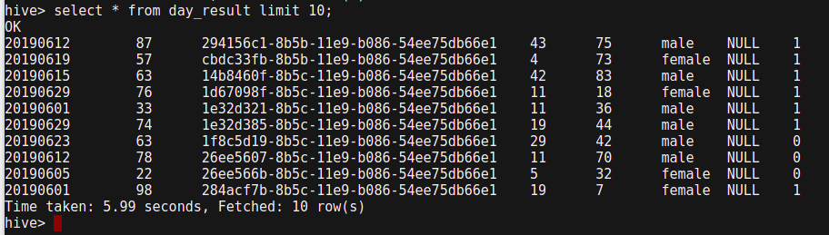

## hive
hive是数据仓库的一种，用于离线计算海量数据，底层基于hdfs和mapreduce,对外提供sql操作，将sql语句转成mapreduce任务执行。

运行hive命令进入交互界面，执行sql语句可以看到任务执行的过程

select count(*) from mytable;  需要执行计算，会比较慢，一万条数据的表里面，耗时要一个小时

select * from mytable;    只取数据不执行计算，没有起job,所以执行比较快

## presto
快速查询引擎，能够对接hive,mysql等多种数据库或数据仓库作为数据源，也可以直接对接hdfs的文件作为数据源。
在项目中，往往有多种(mysql, pg, redis)或多个数据库(pg有多个实例)，presto是为了将多个数据库统一起来提供统一的接口作为查询用，一个查询分发到不同的数据库，
各个数据库自身执行查询之后然后再将结果汇总。  如果是MySQL等数据库，通过presto的查询本身都需要数据库自身再过一遍，增加了查询链路的长度，不会提高查询性能。
而对于hdfs,hive等系统，是直接从hdfs的文件进行操作，是可以加速的,presto对hive的加速效果比较明显。