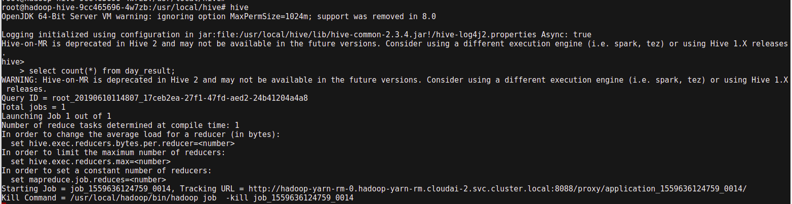
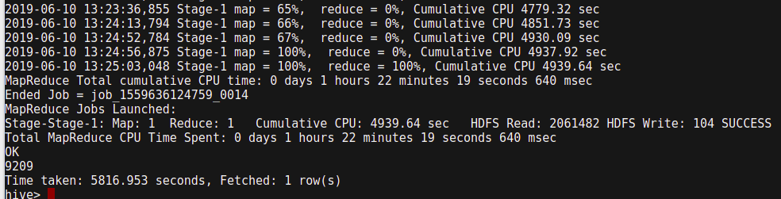

## hive
hive是数据仓库的一种，用于离线计算海量数据，底层基于hdfs和mapreduce,对外提供sql操作，将sql语句转成mapreduce任务执行。

运行hive命令进入交互界面，执行sql语句可以看到任务执行的过程

select count(*) from mytable;  需要执行计算，会比较慢，一万条数据的表里面，耗时要一个小时

select * from mytable;    只取数据不执行计算比较快

## presto
快速查询引擎，能够对接hive,mysql等多种支持sql的数据源，通过加大内存加速查询过程