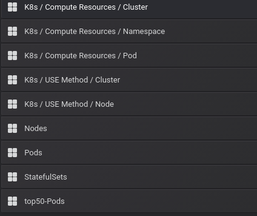
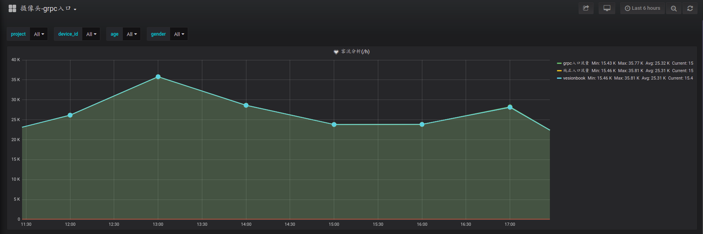
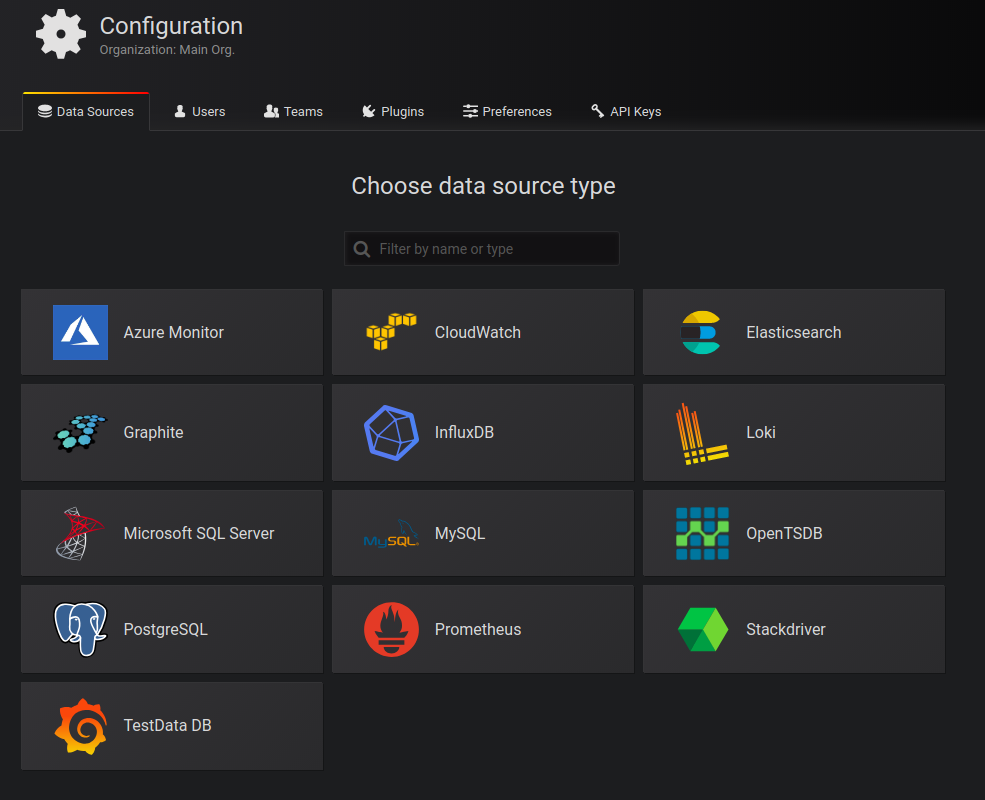

## grafana
Grafana可以作为Kibana的替代品，grafana也支持es数据源，可同时用于日志分析和监控信息的展示。
grafana是用于可视化大型测量数据的开源程序，他提供了强大和优雅的方式去创建、共享、浏览数据。
grafana有热插拔控制面板和可扩展的数据源，目前已经支持Graphite、InfluxDB、OpenTSDB、Elasticsearch等。

grafana用于展示，可以定制各种指标曲线，在k8s中的监控应用中，可以展示pod的资源消耗，也可以展示cluster每个node
的资源消耗。

可以兼容整个k8s集群的所有pod,先选择namespace,再选择pod， 指标曲线自行定义

监控k8s中节点的资源

作为业务指标的一个看板

grafana支持的数据源,与prometheus结合是将prometheus作为数据源，prometheus-server将监控指标进行了保存，由grafana进行读取。

如果要增加其他类型的数据源比如hbase,需要通过插件进行扩展，并且要提供供查询到接口，返回特定的数据格式，需要自行写代码实现。
grafana通过自行编写查询语句，可以方便的与业务结合起来，不仅用于系统监控还可以用于业务监控。
<grafana将自己的数据库（hbase）设置为数据源>  https://blog.csdn.net/luanpeng825485697/article/details/84317565

组成: node-exporter要作为daemon-set运行

## k8s上部署

rancher能够部署prometheus和grafana,每个只起了一个pod,但每个pod里面有多个container，Prometheus-Pushgateway要单独部署，
需要再起一个服务将端口暴露出来。自行部署的话也可以每个组件起一个pod，需要的组件如下，

    prometheus-alertmanager-769b699f7c-cljtc         
    prometheus-grafana-5c688fc56c-wjwss              
    prometheus-kube-state-metrics-7b88469749-67kvk   
    prometheus-node-exporter-4dfsh                   
    prometheus-server-556f95bc4-fcfp4
    prometheus-operator
    
    
手动部署

在master节点:

    git clone https://github.com/redhatxl/k8s-prometheus-grafana.git # 下载部署用yaml文件
    kubectl create -f  k8s-prometheus-grafana/node-exporter.yaml  # 部署node-exporter组件，以daemon-set方式运行
    node-exporter 查看http://localhost:31672/metrics
    
部署prometheus组件：

    kubectl create -f  k8s-prometheus-grafana/prometheus/rbac-setup.yaml
    kubectl create -f  k8s-prometheus-grafana/prometheus/configmap.yaml 
    kubectl create -f  k8s-prometheus-grafana/prometheus/prometheus.deploy.yml
    kubectl create -f  k8s-prometheus-grafana/prometheus/prometheus.svc.yml
    
    界面访问 http://localhost:30003/target 
    
部署grafana组件:

     kubectl create -f   k8s-prometheus-grafana/grafana/grafana-deploy.yaml
     kubectl create -f   k8s-prometheus-grafana/grafana/grafana-svc.yaml
     kubectl create -f   k8s-prometheus-grafana/grafana/grafana-ing.yaml
     
     界面访问 http://localhost:3000   admin/admin
     由于官方grafana镜像支持的数据源或者展示面板不够丰富,根据需要重新封装镜像
     
     
## 物理机安装

Ubuntu 

    wget https://dl.grafana.com/oss/release/grafana_6.2.2_amd64.deb
    sudo dpkg -i grafana_6.2.2_amd64.deb     
    
    service grafana-server start/stop  启动之后会开启3000端口
    sudo systemctl enable grafana-server.service设置开机自动启动
    
    配置文件位置：/etc/grafana/grafana.ini
    日志文件位置：/var/log/grafana/grafana.log
    
     
## 关联pgsql
step1 添加数据源，即配置从哪个数据库读取指标数据，以postgresql为例，ssl mode设置为disable，不然会出x509的错误。

step2 数据库构建表结构，构造数据 
    
    create table grade(id int, score int);  
    insert into grade select (random()*(100))::integer,(random()*(100))::integer from generate_series(1,100) ;
    generate_series是产生100个，random是每个数随机的范围，

step3 新建一个用于展示的graph(dashboard)

    一个dashboard就是打开的一个界面，在上面可以创建多个panel(每个面板对应一个query)。多个相关联的dashboard可以组织在一个作为一个folder。
    默认有General这个folder
    
    进入到dashbord之后即可以自行编辑面板，右上角第一个图标就是add panel，点击及进行配置，包含queries, visualization,general,alert四个步骤。
    在query的表格里边输入如下sql查询语句
    select
                    now() as time,
    
                    case when (score >=80) then '[80, ~)'
    
                    when (score >=60 and score <80) then '[60, 80)'
    
                    when (score >=40 and score <60) then '[40, 60)'
    
                    when (score >=20 and score <40) then '[20, 40)'
    
                    else '(~, 20)'
    
                    end grade, count(*) num
    
    from grade group by
    
                    case when (score >=80) then '[80, ~)'
    
                    when (score >=60 and score <80) then '[60, 80)'
    
                    when (score >=40 and score <60) then '[40, 60)'
    
                    when (score >=20 and score <40) then '[20, 40)'
    
                    else '(~, 20)' end
    
                    order by 1;

    在visualization中设置显示方式，在Axes中将X-Axis设置为Series，数据就可以以柱状的形式显示出来。
    
    每个panel的位置都可以拖动，点击panel name旁边的下拉三角，也可以再次进行编辑
    
    
## 关联prometheus

有三种方式，1是按照正常的new dashboard，然后选择prometheus，自建查询语句。
二是使用自带的模板，进入data source,选择prometheus 数据源，然后旁边有个settings，点击import即可。grafana对于每个数据源都有一套默认的模板。
三是导入自定义模板，在new dashboard旁边有import，进入后选择json文件，json模板下载 https://grafana.com/dashboards/405或https://grafana.com/dashboards/159 可以通过模版Id方式安装.
json文件名是什么导入之后的dashboard就是什么名。

<prometheus和grafana> https://www.hi-linux.com/posts/25047.html 