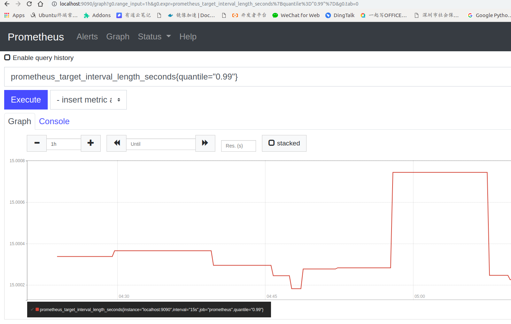

## 整体介绍

传统的监控比如zabbix一般是监控物理机或者虚拟机上的cpu,网络等资源信息,需要在被监控的对象上安装一个agent,
用于定期收集数据并上报。zabbix适合于监控机器，而不方便监控服务。在微服务场景中，通过docker起服务，需要监控到
每个服务的运行状态，CPU等信息，在docker里面安装一个agent显得比较笨重，不方便。所以prometheus出来了，
在每个微服务中提供一个http接口，用于传输metric信息，prometheus定时从这个接口去拉取，然后存储到自己的时序数据库。
另外也提供了pushgateway,支持服务的metric主动push到gateway,但prometheus仍然是定期去gateway拉取。
常用的组件大部分都有exporter可以直接使用，比如Nginx、MySQL

prometheus可能会丢数据，导致监控的曲线中断，但不影响其广泛使用。
   
## 部署
二进制部署
    
    从官网或者github上下载二进制安装包
    tar xvfz prometheus-*.tar.gz
    cd prometheus-*
    
    以监控自己为例，使用默认的配置文件prometheus.yml，只监控prometheus应用本身，不监控服务器
    ./prometheus --config.file=prometheus.yml  # 启动prometheus

部署在k8s: rancher, helm或者自定义的yaml文件部署
    
    基本的组件一样，但在k8s中要多部署一些组件Operator， service, servicemonitor 
    
    自定义部署
    cd ./yaml-template
    kubectl create ns monitoring 
    kubectl create -f ./operator/operator-sa.yml 
    kubectl create -f ./operator/operator-rbac.yml 
    kubectl create -f ./operator/operator-svc.yml 
    kubectl create -f ./operator/operator-dp.yml 
    kubectl create -f ./alertmanater/alertmanager-main-sa.yml # 创建alert的配置文件，定义报警方式 
    kubectl create -f ./alertmanater/alertmanager-main-secret.yml 
    kubectl create -f ./alertmanater/alertmanager-main-svc.yml 
    kubectl create -f ./alertmanater/alertmanager-main.yml 
    kubectl create -f ./node-exporter/node-exporter-sa.yml 
    kubectl create -f ./node-exporter/node-exporter-rbac.yml 
    kubectl create -f ./node-exporter/node-exporter-svc.yml 
    kubectl create -f ./node-exporter/node-exporter-ds.yml 
    kubectl create -f ./kube-state-metrics/kube-state-metrics-sa.yml 
    kubectl create -f ./kube-state-metrics/kube-state-metrics-rbac.yml 
    kubectl create -f ./kube-state-metrics/kube-state-metrics-svc.yml 
    kubectl create -f ./kube-state-metrics/kube-state-metrics-dp.yml 
    kubectl create -f ./grafana/grafana-sa.yml 
    kubectl create -f ./grafana/grafana-source.yml # 自定义配置文件，定义显示方式 
    kubectl create -f ./grafana/grafana-datasources.yml 
    kubectl create -f ./grafana/grafana-admin-secret.yml 
    kubectl create -f ./grafana/grafana-svc.yml 
    kubectl create -f ./grafana/grafana-dp.yml 
    kubectl create -f ./service-discovery/kube-controller-manager-svc.yml 
    kubectl create -f ./service-discovery/kube-scheduler-svc.yml 
    kubectl create -f ./prometheus/prometheus-rules.yml # 自定义配置文件，定义收集和报警规则 
    kubectl create -f ./prometheus/prometheus-sa.yml 
    kubectl create -f ./prometheus/prometheus-rbac.yml 
    kubectl create -f ./prometheus/prometheus-svc.yml 
    kubectl create -f ./prometheus/prometheus-main.yml 
    kubectl create -f ./pushgateway/pushgateway-serviceaccount.yaml 
    kubectl create -f ./pushgateway/pushgateway-service.yaml 
    kubectl create -f ./pushgateway/pushgateway-deployment.yaml 
    kubectl create -f ./servicemonitor/alertmanager-sm.yml # 创建监控目标 
    kubectl create -f ./servicemonitor/coredns-sm.yml # 创建监控目标 
    kubectl create -f ./servicemonitor/kube-apiserver-sm.yml # 创建监控目标 
    kubectl create -f ./servicemonitor/kube-controller-manager-sm.yml # 创建监控目标 
    kubectl create -f ./servicemonitor/kube-scheduler-sm.yml # 创建监控目标 
    kubectl create -f ./servicemonitor/kubelet-sm.yml # 创建监控目标 
    kubectl create -f ./servicemonitor/kubestate-metrics-sm.yml # 创建监控目标 
    kubectl create -f ./servicemonitor/node-exporter-sm.yml # 创建监控目标 
    kubectl create -f ./servicemonitor/prometheus-operator-sm.yml # 创建监控目标 
    kubectl create -f ./servicemonitor/prometheus-sm.yml # 创建监控目标 
    kubectl create -f ./servicemonitor/pushgateway-sm.yml # 创建监控目标

    <手动部署在k8s>  https://blog.csdn.net/luanpeng825485697/article/details/83755430

配置文件说明：
    
    # 全局配置
    global:
      scrape_interval:     15s # 默认抓取间隔, 15秒向目标抓取一次数据。
      evaluation_interval: 15s # Evaluate rules every 15 seconds. The default is every 1 minute.
      # scrape_timeout is set to the global default (10s).
    
      # 这个标签是在本机上每一条时间序列上都会默认产生的，主要可以用于联合查询、远程存储、Alertmanger时使用。
      external_labels:
          monitor: 'codelab-monitor'
    
    # Load rules once and periodically evaluate them according to the global 'evaluation_interval'.
    rule_files:
      # - "first.rules"
      # - "second.rules"
    
    # 这里就表示抓取对象的配置
    # 这里是抓去promethues自身的配置
    scrape_configs:
    # job name 这个配置是表示在这个配置内的时间序例，每一条都会自动添加上这个{job_name:"prometheus"}的标签。
      - job_name: 'prometheus'
    
        # metrics_path defaults to '/metrics'
        # scheme defaults to 'http'.
    
        # 重写了全局抓取间隔时间，由15秒重写成5秒。
        scrape_interval: 5s
    
        static_configs:
          - targets: ['localhost:9090']

## 使用
自带一个简单的web: localhost:9090/graph, 可以查看表达式搜索结果、报警配置、prometheus配置,exporter状态等.
Prometheus本身也是自带exporter的,我们通过请求 http://ip:9090/metrics 可以查看从exporter中能具体抓到哪些数据，
这里能看到能够抓取哪些指标，也能看到对应的值。不断请求localhost:9090/metric,可以看到promhttp_metric_handler_requests_total{code="200"} 416不断刷新
metric分为counter,gauge,histogram,summary四种类型。

Prometheus Web界面自带的图表是非常基础的，比较适合用来做测试。如果要构建强大的Dashboard，需要grafana等工具。

打开prometheus web页面， 输入框中输入metric查询语句，点击execute就会查询数据并渲染
    
    prometheus_target_interval_length_seconds
    prometheus_target_interval_length_seconds{quantile="0.99"}
    

## 监控本地服务器

为监控服务器CPU、内存、磁盘、I/O等信息，首先需要安装node_exporter。node_exporter的作用是用于机器系统数据收集

    wget https://github.com/prometheus/node_exporter/releases/download/v0.14.0/node_exporter-0.14.0.linux-amd64.tar.gz
    tar -zxvf node_exporter-0.14.0.linux-amd64.tar.gz
    mv node_exporter-0.14.0.linux-amd64 /usr/local/prometheus/node_exporter
    启动 ./node-exporter
    
    修改prometheus.yml，加入下面的监控目标：Node Exporter默认的抓取地址为http://IP:9100/metrics
    
    vim  prometheus.yml
      - job_name: 'linux'
        static_configs:
          - targets: ['localhost:9100']
            labels:
              instance: node1
              
    重启prometheus,
    可以在prometheus界面，输入node,看到node的metrics 
    访问Prometheus Web，在Status->Targets页面下，我们可以看到我们配置的两个Target
    输入node_memory_Active_bytes点击执行，就可以看到内存监控曲线

## 组件介绍

prometheus server

    手机和存储时间序列数据，就是个时序数据库

exporter(client library)
    
    Prometheus官网有很多exporter，exporter可以理解为采集客户端，即采集指标，通过http方式暴露metrics给prometheus，Prometheus通过pull方式拉取这些指标
    
push gateway

    使用push gateway的原因
    Prometheus 采用 pull 模式，可能由于不在一个子网或者防火墙原因，导致Prometheus 无法直接拉取各个 target数据。
    在监控业务数据的时候，需要将不同数据汇总, 由 Prometheus 统一收集。
    
    弊端
    将多个节点数据汇总到 pushgateway, 如果 pushgateway 挂了，受影响比多个 target 大。
    Prometheus 拉取状态 up 只针对 pushgateway, 无法做到对每个节点有效。
    Pushgateway 可以持久化推送给它的所有监控数据。
    因此即使你的监控已经下线，prometheus 还会拉取到旧的监控数据，需要手动清理 pushgateway 不要的数据
    
    数据推到push gateway可以通过sdk推送，也可以通过访问API
    echo "some_metric 3.14" | curl --data-binary @- http://pushgateway.example.org:9091/metrics/job/some_job

    
Alertmanager

    告警用的组件，监控的同时告警才有效果，感知不到系统的变化。
    从 Prometheus server 端接收到 alerts 后，会进行去除重复数据，分组，并路由到对收的接受方式，发出报警。常见的接收方式有：电子邮件，pagerduty，OpsGenie, webhook 等
    
    

    
