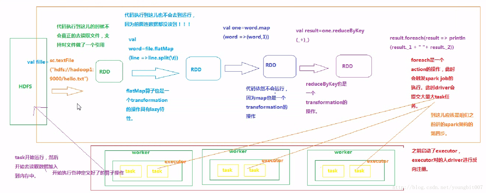

## 大数据平台介绍
Hadoop, spark等都是大数据计算引擎,当前已经发展到了第四代,Hadoop是第一代,spark是第三代,flink是第四代. Hadoop 2.0也称为YARN.
spark和flink都可以在裸机上部署,也可以在Hadoop集群上面部署
大数据应用场景:  比如一个10G的日志文件,要统计其行数
Hadoop需要自己写map reduce函数
spark只需要写类似sql语句一样,一行就能搞定,第三代计算引擎的特点主要是 Job 内部的 DAG 支持（不跨越 Job）
flink与spark的易用性是一样的,只不过spark的流处理是最小是一次执行一个分区的数据,不能每条数据都实时技术，而flink最少是一条数据.

mapreduce的实现需要JobTracker和TaskTracker两种角色
Jobtracker是主线程，它负责接收客户作业提交，调度任务到工作节点上运行，并提供诸如监控工作节点状态及任务进度等管理功能，一个MapReduce集群有一个jobtracker，一般运行在可靠的硬件上。
tasktracker由jobtracker指派任务，实例化用户程序，在本地执行任务并周期性地向jobtracker汇报状态。在每一个工作节点上永远只会有一个tasktracker。Tasktracker和DataNode运行在一个机器上，
从而使得每一台物理机器既是一个计算节点，同时也是一个存储节点。每一个tasktracker能够配置map和reduce的任务片数（taskslot），这个数字代表每一种任务能被并行执行的数目。
tasktracker是通过周期性的心跳来通知jobtracker其当前的健康状态，每一次心跳包含了可用的map和reduce任务数目、占用的数目以及运行中的任务详细信息。

Hadoop1.0只实现了hdfs和mapreduce两大基本功能,因此也就只有namenode, datanode, jobtracker, tasktracker,因为namenode和jobtracker的单点限制,支持的集群规模上限有限.
除此之外还有资源管理低效, 资源无法隔离等问题.
2.0引入了yarn模块,实现了资源更高效的管理, 有ResourceManager, NodeManager, ApplicationMaster, container(非docker)角色,去掉了之前的jobtracker和tasktracker.
JobTracker由资源管理和作业控制两部分组成，功能过多而造成负载过重，从设计角度上看，Hadoop未能够将资源管理相关功能与应用程序相关功能非开，造成Hadoop1.0难以支持多种计算框架。
而YARN通过将资源管理和应用程序管理两部分分剥离开，分别由ResouceManager和ApplicationMaster负责，其中，ResouceManager专管资源管理和调度，
而ApplicationMaster则负责与具体应用程序相关的任务切分、任务调度和容错等.

对 Flink 而言，其所要处理的主要场景就是流数据，批数据只是流数据的一个极限特例而已。即Flink 会把所有任务当成流来处理，这也是其最大的特点。
在 Flink 集群中，计算资源被定义为 Task Slot。每个 TaskManager 会拥有一个或多个 Slots。JobManager 会以 Slot 为单位调度 Task。
但是这里的 Task 跟我们在 Hadoop 中的理解是有区别的。对 Flink 的 JobManager 来说，其调度的是一个 Pipeline 的 Task，而不是一个点。
举个例子，在 Hadoop 中 Map 和 Reduce 是两个独立调度的 Task，并且都会去占用计算资源。对 Flink 来说 MapReduce 是一个 Pipeline 的 Task，只占用一个计算资源。

Spark 2.0之前,核心类型接口是RDD,2.0之后就是Dataset, RDD是通用的数据,可以是结构化或非结构化, 而Spark SQL对结构化数据特有的类sql操作.
hive也是将sql操作翻译为mr方式执行,hive on spark大体与SparkSQL结构类似，只是SQL引擎不同，但是计算引擎都是spark.

为什么要实现DAG:大数据处理引擎最开始是mapreduce,将计算分为两个阶段，分别为 Map 和 Reduce。对于上层应用来说，就不得不想方设法去拆分算法，
甚至于不得不在上层应用实现多个 Job 的串联，以完成一个完整的算法，例如迭代计算. 完成一个复杂的任务得由开发人员将任务进行分解, 手动拆分为map和reduce,以及中间过程,最终形成一个dag.

spark的dag: 各个rdd之间存在依赖关系,rdd分原生rdd即通过文件生成的,以及从其他rdd变换过来,从其他rdd变换过来存在依赖关系,
这些依赖关系形成DAG. DAGScheduler对这些依赖关系形成的DAG，进行Stage划分，划分的规则很简单，从后往前回溯，遇到窄依赖加入本stage，遇见宽依赖进行Stage切分。
完成了Stage的划分,DAGScheduler基于每个Stage生成TaskSet,并将TaskSet提交给TaskScheduler。TaskScheduler 负责具体的task调度,在Worker节点上启动task。

ml和mllib都是Spark中的机器学习库,但只支持传统的机器学习,不支持深度学习,因为spark对结构化数据支持的比较好
目前常用的机器学习功能2个库都能满足需求,ml功能更全面更灵活，未来会主要支持ml，mllib很有可能会被废弃
mllib的pipeline可以使得多个机器学习的算法顺序执行,每一步都依赖上一步的结果.不能可视化,都放到pipeline.fit接口里面后,所定义的任务按顺序执行.
spark 结合keras可以对深度学习做训练,但是数据仍然得是结构化的.

yarn的工作流程:
提交任务到yarn, yarn由resourcemanage分配资源,然后启动一个am,再由am申请资源运行task.
spark on yarn中的resourcemanage是常驻的,applicationmaster是client每提交一个任务生成一个. 生成am之后,am再想rm去申请container
用于执行具体的任务, 往往是会申请多个任务. 然后再有schedular具体的分配任务个数,传递参数,再启动进程.
schedular是spark的schedular,这个schedular的位置可以是client端,可以在applicationmaster上,所以spark on yarn有YARN-Client和YARN-Cluster两种模式

## spark介绍
Spark是用Scala来写的，Scala是基于java的，是一种运行在Java虚拟机上并且能够使用Java库的编程语言，代码都运行在jvm上。所以Spark对Scala肯定是原生态支持的，要安装spark要事先安装jdk和Scala。
Spark环境的搭建，主要包括四个步骤：JDK的安装，Scala的安装，Hadoop的安装，Spark的安装。

## 安装
jdk安装参考hbase的部署过程

Scala安装：

    从官网http://www.scala-lang.org/download/2.11.6.html下载Scala 2.11.6版本，页面底部选择scala-2.11.6.tgz 下载
    解压到/usr/local/scala目录
    设置环境变量/etc/profile
    export SCALA_HOME=/usr/local/scala/
    export PATH=$PATH:$SCALA_HOME/bin
    测试Scala是否安装成功: scala -version
    
spark安装：

    从官网http://spark.apache.org/downloads.html下载2.4.2版本
    解压到/usr/local/spark
    设置环境变量/etc/profile
    export SPARK_HOME=/usr/local/spark
    export PATH=$PATH:$SPARK_HOME/bin
    
    设置spark的运行配置，配置文件在/usr/local/spark/conf/目录
    cp spark-env.sh.template spark-env.sh
    spark-env.sh.template是一个模板文件里面有没有配置，在其中添加java，Scala，hadoop，spark的配置
    export JAVA_HOME=/usr/java/jdk1.8.0_91
    export SCALA_HOME=/usr/scala/scala-2.11.6
    export SPARK_MASTER=192.168.56.112
    export SPARK_WORKER_MEMORY=1g
    export HADOOP_HOME=/home/hadoop/package/hadoop-2.7.2/etc/hadoop
    配置slaves文件,
    cp slaves.template slaves  # 该文件默认是localhost
    # master  如果有slave节点就要配置master和slave，并且在slave节点重复配置过程做相同的配置
    #slave1
    
    启动spark并测试
    先启动Hadoop
    ${HADOOP_HOME}/sbin/start-all.sh
    启动spark
    ${SPARK_HOME}/sbin/start-all.sh
    能够打开界面http://localhost:8080/说明启动成功

##　spark命令行使用
1.通过spark-submit命令直接提交任务：${SPARK_HOME}./bin/spark-submit --class org.apache.spark.examples.SparkPi  
--master spark://intsmaze-131:7077  --executor-memory 1G  --total-executor-cores 2 /usr/local/spark/examples/jars/spark-examples_2.12-2.4.2.jar 100

也可以直接提交Python代码：./bin/spark-submit /home/wordcount.py

2.运行spark-shell进入到命令行模式： 在spark shell中用scala语言编写spark程序,实质是启动一个SparkSubmit进程来模拟Spark运行环境，是一个单机版的

执行wordcount的例子
	
    val inputfile = sc.textFile(“input.txt”)  #　从文本文件中创建一个简单的 RDD
    val counts = inputfile.flatMap(line => line.split(" ")).map(word => (word, 1)).reduceByKey(_+_);　# 执行此操作后，不会有任何输出，因为这不是一个动作，这是一个转换; 指向一个新的RDD或告诉spark，用给定的数据来做什么
    counts.toDebugString         # 当前RDD及其依赖调试的描述
    counts.cache()               # 标记一个RDD，即将结果暂存到内存，加速计算
    counts.saveAsTextFile("output")
    
    
    也可以直接一行就可以搞定,先上传文件到hdfs
    sc.textFile("hdfs://localhost:9000/words.txt").flatMap(_.split(" ")).map((_,1)).reduceByKey(_+_).saveAsTextFile("hdfs://localhost:9000/out")

## RDD
弹性分布式数据集RDD中的数据与Python中的list等类型没什么区别，也是个对象，只是RDD是分区存储的，这样不同分区的数据就可以分布在不同的机器上，能够支持更大的数据，
同时可以被并行处理。因此，Spark应用程序所做第一步就是把需要处理的数据转换为RDD，然后对RDD进行一系列的变换和操作从而得到结果
因为是在内存中，就可以有效地在并行操作中复用（在机器学习这种需要反复迭代的任务中非常有效）。
在节点发生错误时RDD也可以根据其Lineage自动计算恢复.RDD是Spark的最基本抽象，是对分布式内存的抽象使用，以操作本地集合的方式来操作分布式数据集的抽象实现。 
它表示已被分区、不可变的、能够被并行操作的数据集，不同的数据集格式对应不同的RDD实现。RDD必须是可序列化的。
RDD只能从持久存储或通过Transformation操作产生。
RDD的操作分转换(transformations)和动作(actions)，转换是map,filter等，告诉spark下一步要执行什么操作，但不会立即执行。动作如saveAsTextFile是会立即执行的。
每个分区的数值计算都是在一个任务中进行的，因此任务的个数，也是由RDD(准确来说是作业最后一个RDD)的分区数决定。

RDD中的每个元素就是item,可以遍历，item的类型可以是数值，字符串，k-v对等。

spark api类型有rdd api,DataFrame API 和 Machine Learning API， rdd api是最基础的，但是太底层。

RDD操作的执行过程 

用户编写的spark程序就是driver,driver会把计算任务分成一系列小的task，然后送到executor执行。executor之间可以通信，

Hadoop中的每步操作都要读取磁盘，io开销和序列化时间消耗比较大。spark的改进就是中间结果放内存，最开始的输入数据仍然要从磁盘读取，以及最后的
输出要写回磁盘。 如果数据太大，中间结果也是会存放在磁盘上。
机器学习等算法往往都是迭代型的计算(下一次计算在上一次的计算结果上进行)，那么在Hadoop会被拆分成连续的十至几百个串行的任务(不能复用)，
前后两个任务之间都要经过大量的IO来传递数据.因此业界兴起了一股基于内存计算的潮流，而Spark是代表，它提出了RDD的 概念，
同时它提供了比Hadoop 的MapReduce方式更加丰富的数据操作方式，有些需要分解成几轮的Hadoop操作，可在Spark里一轮实现。

## spark sql
Spark为结构化数据处理引入了一个称为Spark SQL的编程模块，该模块提供了一个称为DataFrame的编程抽象。
数据集的来源格式不限，可以是hive表，结构化数据文件，外部数据库或现有RDD，但要是结构化的数据。

从json和txt文件中读取：

people.json文件内容：
{"name": "a"}
{"name": "b", "age":30}
{"name": "c", "age": 19}

people.txt文件：
a, 29
b, 30
c, 19

val sqlContext=new org.apache.spark.sql.SQLContext(sc)
val dfs=sqlContext.read.json("people.json")
dfs.show    # 显示数据
dfs.printSchema()   #　查看dataframe的schema
dfs.select("name").show()  # 从dataframe里选择某一列
dfs.filter(dfs("age")>20).show()  #　利用过滤器筛选