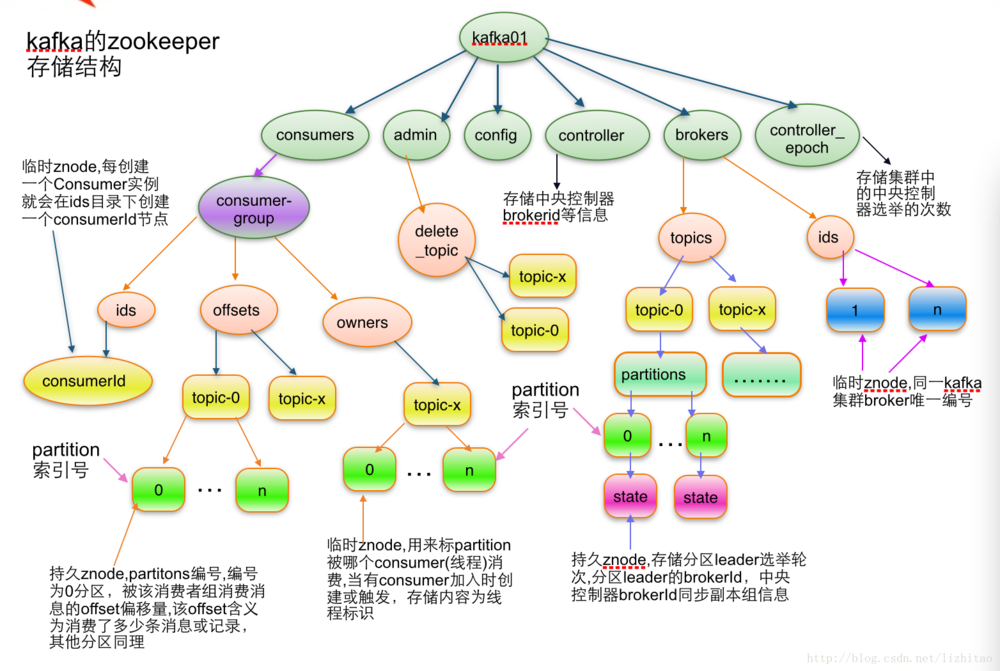
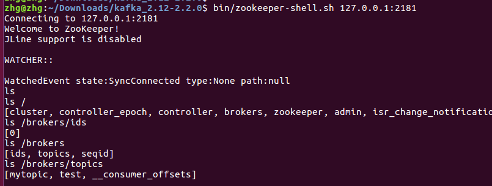

## 安装
    1. 在kafka中集成了zk,下载安装包之后直接启动

## 使用
   连接zk: bin/zookeeper-shell.sh 127.0.0.1:2181，不支持命令补全，不支持上下历史命令查找
   连接后的情况：比如之前创建了topic: mytopic,test，通过命令ls /brokers/topics可以列出来
   操作类似于文件系统中的操作，每个path都是一个节点，都可通过get指令查看里面存储的信息，
   可通过create创建新节点比如create -s /config "001"。
   
   kafka在zk中保存的信息如下
   
   
   zk上的操作
   
   

## 常用命令

    connect host:port
    get path [watch]
    ls path [watch]
    set path data [version]
    rmr path
    delquota [-n|-b] path
    quit 
    printwatches on|off
    create [-s] [-e] path data acl
    stat path [watch]
    close 
    ls2 path [watch]
    history 
    listquota path
    setAcl path acl
    getAcl path
    sync path
    redo cmdno
    addauth scheme auth
    delete path [version]
    setquota -n|-b val path
    
## zk功能与原理
zk是分布式协调技术的一种实现，分布式锁也就是我们分布式协调技术实现的核心内容。

1. 出现的原因及目标：

在分布式环境中，由于网络的不可靠，你对一个服务的调用失败了并不表示一定是失败的，可能是执行成功了，但是响应返回的时候失败了。
还有，A和B都去调用C服务，在时间上A还先调用一些，B后调用，那么最后的结果不一定A的请求就先于B到达。
分布式协调远比多个进程通信同步的调度要难，而且如果每一个分布式应用都开发一个独立的协调程序。
会出现反复编写浪费，且难以形成通用、伸缩性好的协调器。另一方面，协调程序开销比较大，会影响系统原有的性能。
所以，急需一种高可靠、高可用的通用协调机制来用以协调分布式应用。

2. 分布式锁的实现者：
分布式协调技术方面做得比较好的就是Google的Chubby还有Apache的ZooKeeper他们都是分布式锁的实现者。
既然有了Chubby为什么还要弄一个ZooKeeper，主要是Chbby是非开源的，Google自家用。
后来雅虎模仿Chubby开发出了ZooKeeper，也实现了类似的分布式锁的功能，并且将ZooKeeper作为一种开源的程序捐献给了Apache，
那么这样就可以使用ZooKeeper所提供锁服务。而且在分布式领域久经考验，它的可靠性，可用性都是经过理论和实践的验证的。

3. zk概述
它提供了一项基本服务：分布式锁服务。由于ZooKeeper的开源特性，后来在分布式锁的基础上，
摸索了出了其他的使用方法：配置维护、组服务、分布式消息队列、分布式通知/协调等。

zk使用zab协议,在实现这些服务时，首先它设计一种新的数据结构——Znode，然后在该数据结构的基础上定义了一些原语。
因为zk是工作在分布式的环境下，服务是通过消息以网络的形式发送给分布式应用程序，所以还需要一个通知机制——Watcher机制.

znode，兼具文件和目录两种特点。既像文件一样维护着数据、元信息、ACL、时间戳等数据结构，又像目录一样可以作为路径标识的一部分。每个Znode由3部分组成:
zk的服务器和客户端都被设计为严格检查并限制每个Znode的数据大小至多1M,因为配置文件信息、状态信息都是很小的数据。

    stat：此为状态信息, 描述该Znode的版本, 权限等信息
    
    data：与该Znode关联的数据
    
    children：该Znode下的子节点

节点分为临时节点和持久节点，该节点的生命周期依赖于创建它们的会话。一旦会话(Session)结束，临时节点将被自动删除，当然可以也可以手动删除。
另外又有顺序自动编号节点PERSISTENT_SEQUENTIAL，EPHEMERAL_SEQUENTIAL，这种目录节点会根据当前已近存在的节点数自动加 1

zk作为选主的实现代替双机主备
参考： https://www.cnblogs.com/wuxl360/p/5817471.html

配置管理：
一个应用系统有多台server，但某些配置项是相同的，如果要修改这些相同的配置项，那么就必须同时修改每台运行这个应用系统的Server，
这样非常麻烦而且容易出错。可用使用zk解决，将配置信息保存在 Zookeeper 的某个目录节点中，然后将所有共享这个配置的server监控配置信息的状态，
一旦配置信息发生变化，每台应用机器就会收到Zookeeper的通知，然后从 Zookeeper 获取新的配置信息应用到系统中。

分布式锁：
创建一个 EPHEMERAL_SEQUENTIAL(自动编号)目录节点，然后调用 getChildren方法获取当前的目录节点列表中最小的目录节点是不是就是自己创建的目录节点，
zk的每个操作都是原子的，但是有两步操作，那么就存在failed的情况。
如果正是自己创建的，那么它就获得了这个锁，如果不是那么它就调用 exists(String path, boolean watch) 方法并监控 Zookeeper 
上目录节点列表的变化，一直到自己创建的节点是列表中最小编号的目录节点，从而获得锁，释放锁很简单，只要删除前面它自己所创建的目录节点就行了。

集群管理leader election： 通过EPHEMERAL_SEQUENTIAL 目录节点

## zk在kafka中的作用
Kafka通过Zookeeper管理集群配置，选举leader,以及在consumer group发生变化时进行rebalance.
Kafka将元数据信息保存在Zookeeper中，但是发送给Topic本身的数据是不会发到Zk上的。
broker会在zookeeper注册并保持相关的元数据(如topic)更新。而客户端会在zookeeper上注册相关的watcher。
一旦zookeeper发生变化，客户端能及时感知并作出相应调整。
这样就保证了添加或去除broker时，各broker间仍能自动实现负载均衡。这里的客户端指的是Producer和Consumer。
Producer端使用zookeeper用来"发现"broker列表,以及和Topic下每个partition的leader建立socket连接并发送消息。
也就是说每个Topic的partition是由Lead角色的Broker端使用zookeeper来注册broker信息,
以及监测partition leader存活性.Consumer端使用zookeeper用来注册consumer信息,其中包括consumer消费的partition列表等,
同时也用来发现broker列表,并和partition leader建立socket连接,并获取消息.
