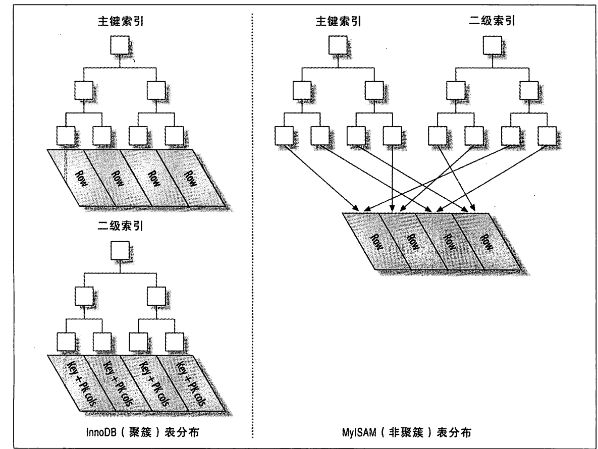
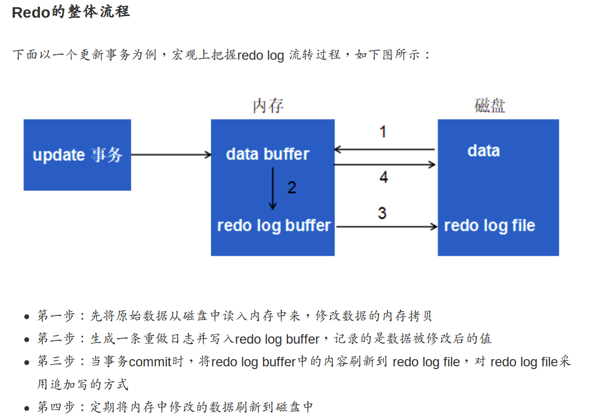

主键和外键：

关系型数据库不能设置两个主键,但可以将两个字段的组合作为一个主键即联合主键.主键是唯一区分,与唯一约束是有区别的,主键一张表只有一个,可以做外键,不能为空，唯一约束可以有多个，主要用来约束字段的唯一性.
外健是关联的数据,联表查询有无外键都可以, update的作为外键的主键的value时或删除主键的记录时,会做关联检查,具体的约束规则可以设置,比如是不允许更新或删除,或者是全部更新或删除,用于保证数据的完整性和一致性,
外键的意义：用于与其他表建立连接，用于预防破坏表之间的链接；防止非法数据插入到外键列，因为要插入的值必须已经是在其他表中的主键出现了才行。
数据库支持事物,支持外键,那么一致性在数据库服务器完成, 如果数据库不支持但又要处理事务就要在在业务代码中完成.
在并发不大压力不大时,可以使用外键,减小开发工作量,很多业务逻辑上的校验不用写代码完成.
但如果互联网行业并发大的时候一般不使用,因为数据库服务器做关联性检查会拖慢数据库的速度.而应用服务器是可以方便扩展的.

创建表的时候很容易字段里面出现空格，建好之后用desc table一下，查看是否有多的空格，不然插入数据会失败。SQL操作时，若字段是关键字，需要单引号转义。

主键和唯一性约束都能保证某个列或者列组合的唯一性，但是：

    一张表中只能定义一个主键，却可以定义多个唯一性约束！
    主键列不允许存放NULL值，而普通的唯一性约束列可以存放NULL值！
    可以多个列组合成主键
    
自增列：

    一个表中最多有一个递增列。
    一般只为整数类型的列定义递增属性，浮点数类型基本不用递增属性。
    具有AUTO_INCREMENT属性的列必须建立索引。主键和具有唯一性约束的列会自动建立索引
    一般递增列都是作为主键的属性，来自动生成唯一标识一个记录的主键值。
    因为具有AUTO_INCREMENT属性的列是从1开始递增的，所以最好用UNSIGNED来修饰这个列，可以提升正数的表示范围。
    

union(联合查询)：被合并的各个查询的查询对象个数必须相同；查询的结果集中显示的列名将以第一个查询中的列名为准；各个查询语句中的查询列表的类型兼容就可以。
union是在竖直方向上合并，字段只跟第一个保持一致。 join是在水平方向合并，字段是两个join字句的并集。
https://blog.csdn.net/ljxfblog/article/details/52066006

## 索引
索引：b树和b+树都是多路平衡搜索树，b树是非叶子节点也会存储数据，b+树只有最后的叶子节点存储数据，用b+树索引是相对于b树每个节点存储的索引信息会更多，
因为不用存储数据。为了方便批量查询，b+树的叶子节点会通过指针连接起来。

常见三种索引对比：

    哈希存储引擎：是哈希表的持久化实现，支持增、删、改以及随机读取操作，但不支持顺序扫描，对于key-value的插入以及查询，
    哈希表的复杂度都是O(1)，明显比树的操作O(n)快,如果不需要有序的遍历数据，可以考虑hash表。但hash表要一次全部加载到内存，容量有限制。
    
    B树存储引擎是B树的持久化实现，不仅支持单条记录的增、删、读、改操作，还支持顺序扫描（B+树的叶子节点之间的指针，B树不支持，因为每个节点都有数据，当然也可以中序便利的方式实现）
    
    LSM树（Log-Structured Merge Tree）存储引擎和B树存储引擎一样，同样支持增、删、读、改、顺序扫描操作。
    而且通过批量存储技术规避磁盘随机写入问题。LSM树和B+树相比，LSM树牺牲了部分读性能，用来大幅提高写性能。
    通过缓存，先将数据写入到内存，同时用日志持久化，因为日志是顺序写入，比随机写入快。然后再进行合并，合并的时候会优化，将逻辑上相邻的数据物理上也相邻，
    这样避免了随机写入和页分裂，提高写的性能。

B+树相比于B树：

    （1) B+tree的磁盘读写代价更低
        B+tree的内部结点并没有指向关键字具体信息的指针。因此其内部结点相对B树更小。如果把所有同一内部结点的关键字存放在同一盘块中，
        那么盘块所能容纳的关键字数量也越多。一次性读入内存中的需要查找的关键字也就越多。相对来说IO读写次数也就降低了。
    
    （2）B+tree的查询效率更加稳定
        由于非叶子结点并不是最终指向文件内容的结点，而只是叶子结点中关键字的索引。所以任何关键字的查找必须走一条从根结点到叶子结点的路。所有关键字查询的路径长度相同，导致每一个数据的查询效率相当。
        
    （3）B树在提高了磁盘IO性能的同时并没有解决元素遍历的效率低下的问题。正是为了解决这个问题，B+树应运而生。
        B+树只要遍历叶子节点就可以实现整棵树的遍历。而且在数据库中基于范围的查询是非常频繁的，而B树不支持这样的操作（或者说效率太低）。
        
     但B+树的缺点：
     B+树最大的性能问题是会产生大量的随机IO，随着新数据的插入，叶子节点会慢慢分裂，逻辑上连续的叶子节点在物理上往往不连续，甚至分离的很远，
     但做范围查询时，会产生大量读随机IO。对于大量的随机写也一样，举一个插入key跨度很大的例子，如7->1000->3->2000 ... 
     新插入的数据存储在磁盘上相隔很远，会产生大量的随机写IO.
     

innodb引擎：

    如果给主键设置了索引就用主键创建主键索引，如果没有就默认以rowid创建索引。主键索引是聚簇索引，最后的叶子节点会存储具体的数据。
    其他字段建的索引都是非聚簇索引，叶子节点不存数据，而是指向主键索引的节点(具体就是主键的值)。这样直接从索引取数据而非从磁盘的文件中取数据。　
    比如id是主键，age是普通索引，走非主键age的查询过程是：索引先根据age搜索等于18的索引记录，找到ID=10的记录，然后再到主键索引搜索一次，然后拿出需要查询的数据。
    从普通索引查出主键索引，然后查询出数据的过程叫做回表。由于回表需要多执行一次查询，这也是为什么主键索引要比普通索引要快的原因，所以，我们要尽量使用主键查询。
    
    非主键索引也被称为二级索引，drop主键索引会导致其他索引失效,但drop普通索引不会
    那相当于存储两份数据，占的空间不是很大？
    
    覆盖索引：要查询的字段都建了索引，就叫做“覆盖索引”。这样的话查询的数据直接从索引中取，不需要在走主键索引树。

主键尽量使用自增主键而非UUID：

    使用自增主键时，每次插入一条新记录,都是追加操作,都不涉及到挪动其他记录,也不会触发叶子节点的分裂。而有业务逻辑的字段做主键,则往往不容易保证有序插入,这样写数据成本相对较高。
    除了考虑性能外,我们还可以从存储空间的角度来看。假设你的表中确实有一个唯一字段,比如字符串类型的身份证号,那应该用身份证号做主键,还是用自增字段做主键呢?
    由于每个非主键索引的叶子节点上都是主键的值。如果用身份证号做主键,那么每个二级索引的叶子节点占用约 20 个字节,而如果用整型做主键,则只要 4 个字节,如果是长整型(bigint)则是 8 个字节。
    显然,主键长度越小,普通索引的叶子节点就越小,普通索引占用的空间也就越小。
    
    有没有什么场景适合用业务字段直接做主键的呢?还是有的。比如,有些业务的场景需求是这样的:
    1. 只有一个索引;
    2. 该索引必须是唯一索引。
    这是典型的 KV 场景。由于没有其他索引,所以也就不用考虑其他索引的叶子节点大小的问题。
    这时候我们就要优先考虑上一段提到的“尽量使用主键查询”原则,直接将这个索引设置为主键。
    
    当然在高并发负载时，主键顺序插入可能会造成明显的争用，会导致间隙锁竞争。

模糊查询是否走索引的问题：

    select * from user where name like 'j' 或 'j%' 或 '%j' 或 '%j%';
    1. like 'j' 或 'j%' 可以使用索引，并且快速定位记录，表象就是查询速度很快。
    2. like '%j' 或 '%j%'，只是在二级索引树上遍历查找记录，并不能快速定位（使用了索引，但是扫描了整棵索引树），表象就是查询速度没那么快。
    两者的区别就是“用索引”和“用索引快速定位记录”，两者都用了索引，但是第二种没有发挥索引的优势，建了索引还遍历所有的索引是低效的。

select * from data where a='1' or b = '2'; 查询语句索引匹配情况： 如果建的是a,b联合索引； 如果a，b分别建的独立索引

可以对一个列创建多个相同的索引，没有任何用处，如果有需要移除。mysql的唯一限制和主键限制都是通过索引实现的。
    
    下面这条语句会在id列上创建3个索引
    create table test(id int not null primary key, a int not null, unique(id), index(id));
    
冗余索引: 先创建索引(A,B)，再创建索引(A就是冗余索引。
    
衡量查询开销的三个指标：响应时间，扫描的行数，返回的行数

数据库在更新数据时先更新数据文件在内存的副本，并同时追加到wal(预写日志)做持久化，内存中的数据再统一做持久化。
这样每次更新数据是需要两次写入，但wal日志是追加，属于顺序写而非随机写，速度比直接修改数据文件的内容要快。
完整的更新流程是怎么样的？

innodb是一定会有主键索引的，主键索引属于聚簇索引，所以存储方式是数据行和主键索引一起存储，而不会再单独存储一份数据，
不然数据就存储了两份，浪费空间，而且更新的时候效率很低。所以innodb中，聚簇索引就是表。 
myisam的主键索引的叶子节点存放的是数据对应的行指针，所以是非聚簇索引。 innodb的二级索引存的是主键的值，而myisam的二级索引
跟主键索引一样，存的仍然是行指针。又innodb实现了mvcc,主键索引记录中会包含两个必要的列trx_id和roll_pointer。

条件in的查询过程，mysql将in()列表中的数据先进行排序，然后通过二分查找的方式判断每个值，比多个or条件的查询速度要快。
in查询是可以走索引的，建个简单的表测试过。 https://www.xttblog.com/?p=3651

关联查询： MySQL认为任何一个查询都是一次关联，比如关联查询A和B，固定表B，从A里面一行行的读取符合条件的，然后从B表中去匹配。
效是比较低的，如果有多层关联查询，先做底层的关联，生成临时表，再对临时表做关联。

## 高性能mysql

<深入理解 MySQL 事务隔离级别和 MVCC 原理>
https://mp.weixin.qq.com/s/Jeg8656gGtkPteYWrG5_Nw

<MySQL 是怎样运行的：从根儿上理解 MySQL>
https://juejin.im/book/5bffcbc9f265da614b11b731/section/5c0374a06fb9a049d37ed783

innodb默认隔离级别是可重复读，即一个事务当中任何时刻看到的同一行的内容是一样的，但是如果范围查找比如limit得到的结果则是可以变的，
即幻行读取(幻读)。意思就是这种隔离级别不会update已有数据，但是可以新增数据。 用串行化的隔离级别是可以的解决的，但是并发性能太低。
innodb和xtradb存储引擎通过间隙锁的方式解决幻读问题，即对索引的区间加锁。 又提到是多版本并发控制(mvcc)解决？ 

mvcc,在每一行数据增加两个隐藏字段，其中一个就是版本。是行级锁的变种，但在很多情况下避免了加锁操作。
对于使用READ UNCOMMITTED隔离级别的事务来说，直接读取记录的最新版本就好了，对于使用SERIALIZABLE隔离级别的事务来说，使用加锁的方式来访问记录。
对于使用READ COMMITTED和REPEATABLE READ隔离级别的事务来说，就需要用到我们上边所说的版本链了

在同一个数据库实例中不同的表使用不同的存储引擎是可以的。 但在同一个事务中，使用到不同的存储引擎是不可靠的，如果中间有一个存储引擎不支持事务就无法回滚。

避免null的值，因为null使得索引，索引统计和值的比较都更复杂，需要占据更多的空间。
NULL代表没有值，意味着你并不知道该列应该填入什么数据，在判断某一列是否为NULL的时候使用is

数据库支持同时提交多个事务，因为要考虑并发性能，如果这些事务之间不会访问相同的数据，那么只要解决单个事务的问题。
如果访问到相同的数据就有可能出现冲突。数据库设置了一定机制避免冲突，一个事务与其他事务隔离的程度称为隔离级别，隔离级别越高, 数据一致性就越好, 但并发性越弱

冲突可能产生的问题有：脏读，不可重复读，幻读，丢失更新。 SQL标准定义了4个隔离级别：读未提交数据，读已提交数据，可重读，可串行化。
隔离级别的实现，通过锁来解决，具体的方法： https://www.zhihu.com/question/51678508

##　redo 和　undo
　　当insert update delete操作时，数据库先修改内存中的数据(buffer),记录redo log buffer,当buffer到一定程度时才持久化，
   当buffer达到刷新条件才会对文件进行操作。redo log是顺序写入到磁盘，性能比直接随机写数据文件要高。  因为数据并没有真正的写入数据文件，
   当数据库系统崩溃后(比如断电，重启)，会利用redo log和undo log恢复数据。
   恢复的原则： 从前向后读取redo,重做所有已提交的事务；从后往前读取undo,回滚未提交的事务。
    
   每个事务的完成最重要的一个标志就是日志必须落盘，一条日志记录包括redo记录和undo记录，一个事务可能有多次的写操作，
   所以如果每写一条记录，就写一次盘，性能接受不了，所以在一个事务未提交之前，日志会写进log buffer中，在事务提交的时候或者buffer被写满的时候，
   将log刷到磁盘上，log成功落盘后事务才能应答成功，所以如果没有事务并发提交，一个事务完成，至少有一次的落盘操作为了进一步优化落盘性能，
   减少落盘次数，如果是有并发的事务提交，还可能会把并发提交的事务日志做一个合并，一次性写入到磁盘中
    
   Redo log可以简单分为以下两个部分：  https://juejin.im/post/5c3c5c0451882525487c498d
    
        一是内存中重做日志缓冲 (redo log buffer),是易失的，在内存中
        二是重做日志文件 (redo log file)，是持久的，保存在磁盘中

   
   redo流程)
   
   undo log是逻辑日志，对事务回滚时，只是将数据库逻辑地恢复到原来的样子，而redo log是物理日志，记录的是数据页的物理变化，显然undo log不是redo log的逆过程。
   
   普通的非事务中的insert是否会写redo log? 在mysql中，普通的单条语句也是事务，对数据操作之后需要commit才生效，可以打开自动commit，所以也是有redo log的。

## 实战mysql45讲
   查询缓存往往弊大于利,查询缓存的失效非常频繁,只要有对一个表的更新,这个表上所有的查询缓存都会被清空。
   除非你的业务就是有一张静态表,很长时间才会更新一次。比如,一个系统配置表,那这张表上的查询才适合使用查询缓存。
   MySQL 8.0 版本直接将查询缓存的整块功能删掉了。
   
   redo log(重做日志，属innodb引擎)和binlog(归档日志，server层)，而redo log用的是wal(预写日志)技术，先将日志写到缓存，然后再刷到磁盘。
   redo log 是固定大小的,比如可以配置为一组4个文件,每个文件的大小是1GB，是循环更新的。

## Ubuntu 安装mysql
   从官网下载社区版编译好的二进制安装包，目前已到8.0版本。 解压到/usr/local/bin或其他目录下，设置好环境变量。
   
       apt-get install libaio1 安装动态库
       bin/mysqld --initialize --user=mysql  初始化data目录
       bin/mysqld_safe --user=mysql &或bin/mysqld 启动，会给root用户初始化一个随机密码
       mysql -u root -p  连接数据库
       alter user 'root'@'localhost' identified by 'youpassword';  修改密码
       flush privileges;    刷新权限

## mysql集群
MySQL作为关系型数据库的一种，天然不支持分布式，不方便扩容。其集群主要是指高可用集群，比如MMM和MHA方案，实现主从复制以及主从切换。
MySQL不能水平扩展的原因限制了很多应用，许多支持分布式，兼容MySQL的关系型数据库出现，比如阿里的oceanbae, 开源的TiDB.
其中TiDB底层是k-v存储，类似Hbase,对外自行实现了sql解析器和执行器，将k-v存储映射到关系型数据库。

mysql中间件支持分布式的实质是通过分库分表实现，官方的MySQL cluster要求存储引擎是ndb,事务的隔离级别只支持readcommitted,生产环境很少使用。 
由于MySQL本质上不是一个分布式数据库产品，所以cobar的应用会有许多局限，比如不支持跨库的join，
传统的分库分表本来就是非常成熟的技术，cobar等只是简化了这个过程

MySQL cluster是在关系型的基础上做分布式，使得实现复杂， 读和写事务很复杂。而TiDB是先确定做分补水，然后实现关系型标准，架构上更简单。

## 分库分表与分区
分库： 将表拆分后放到不同的库，不同的库可以在不同的数据库实例，从而实现多服务器扩展
分表： 将表拆分后仍然在同一个库，库内分表只解决了单一表数据量过大的问题，但没有将表分布到不同机器的库上，因此对于减轻MySQL数据库的压力来说，
帮助不是很大，大家还是竞争同一个物理机的CPU、内存、网络IO，最好通过分库分表来解决。
分库分表： 即将表拆分到不同的库
分区： 数据库本身支持的功能，表的存储分为不同的文件，所有的分区文件仍然在同一台服务器上，hbase等数据库天然就是分区，并且不同分区可以在不同服务器上

分库带来的问题：

    1. 事务支持，扩库事务就成分布式的了，问题难度显然上升了一个级别
    2. 查询结果合并，比如order by/limit/查询中不带分表(partion key)字段，需要遍历所有库然后在业务代码中进行内存合并
    3. join，这个更难

数据库扩展：

数据库的扩展一般可分为读的扩展、写的扩展以及数据量的扩展。
对于读的扩展，通过复制架构，增加更多的从库，是可以大大缓解读的，而在合适的时机使用缓存架构，是普遍认为更良好的一种解决方案。
对于写的扩展，复制架构其实无助于解决问题，如果不能从应用层减少数据的写入，我们只能进行垂直或者水平的拆分，把数据的写入平均分布到多个节点。
对于数据量的扩展，也是水平切分，支持多节点

参考：

    <数据库分库分表，何时分？怎样分？> https://juejin.im/entry/5c258e02f265da617573d346
    <五大常见的MySQL高可用方案> https://zhuanlan.zhihu.com/p/25960208
    <mysql cluster适用场景分析>： http://blog.chinaunix.net/uid-26950862-id-4573456.html
    <数据库中间件> https://www.zhihu.com/question/36758780
    <关于MySQL集群的一些看法> https://zhuanlan.zhihu.com/p/20204156
    <假如让你来设计数据库中间件> https://mp.weixin.qq.com/s/6kuVgdO7RBs9gs229wG3wA
    <数据库中间件360 Atlas调研笔记> https://mp.weixin.qq.com/s/31WOensXaLdaAp9WRMW7PA
    <业界难题-“跨库分页”的四种方案> https://mp.weixin.qq.com/s/h99sXP4mvVFsJw6Oh3aU5A
    <数据库架构设计与业务的变化> https://mp.weixin.qq.com/s/qbVrQ_aUdL9k28XVinpJXA
    