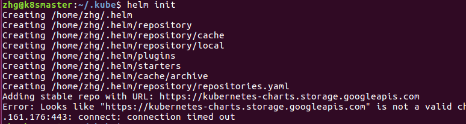

## helm介绍

docker是其单一的应用，docker-compose可以起多个相关的应用，但都在同一个服务器上，而k8s上同一组服务的不同应用可以起在不同的服务器上。
k8s管理和部署应用最直接的方式是写yaml文件，但如果一个应用包含十几个服务，而且需要各种volume,配置也比较多，直接写yaml文件是比较复杂，
有helm和ks可以简化管理和部署,虽然用到的yaml文件还是得事先写好。

最开始都是基于yaml文件来进行部署发布的，当项目变大拆分成微服务化或者模块化，会分成很多个组件来部署，每个组件可能对应一个deployment.yaml,
一个service.yaml,一个Ingress.yaml，还可能存在各种依赖关系。这样一个项目如果有5个组件，很可能就有15个不同的yaml文件，这些yaml分散存放，
如果某天进行项目恢复的话，很难知道部署顺序，依赖关系等。 通过helm来解决yaml配置的集中存放，项目的打包和组件间的依赖。


Helm 采用客户端/服务器架构，由如下组件组成：

    Helm CLI 是 Helm 客户端，可以在 Kubernetes 集群的 master 节点或者本地执行。
    Tiller 是服务器端组件，在 Kubernetes 集群上运行，并管理 Kubernetes 应用程序的生命周期。
    Repository 是 Chart 存储库，Helm 客户端通过 HTTP 协议来访问存储库中 Chart 的索引文件和压缩包。


基本概念：

    Chart：helm的包， 包含了运行一个应用所需要的镜像、依赖和资源定义等yaml文件，比如pgsql.tgz的包就包含启动pgsql所有需要的文件
    Release：在 Kubernetes 集群上运行的 Chart 的一个实例。一个 Chart 可以安装很多次。
    例如一个 MySQL Chart，如果想在服务器上运行两个数据库，就可以把这个 Chart 安装两次。每次安装都会生成自己的 Release
    Repository：用于发布和存储 Chart 的存储库。chart可以存放在本地，但不方便

helm可以作为yaml模板渲染引擎，
helm template compose > generated-docker-compose.yml


## helm安装

在能够执行kubectl的服务器上安装客户端,不然helm无效
    
    脚本安装：
    curl -LO https://git.io/get_helm.sh
    chmod 700 get_helm.sh
    ./get_helm.sh
    
    或者直接执行 curl -L https://git.io/get_helm.sh | bash
    
    二进制安装
    wget https://get.helm.sh/helm-v2.14.1-linux-amd64.tar.gz
    tar -zxvf helm-v2.14.1-linux-amd64.tgz
    mv linux-amd64/helm /usr/local/bin/helm
    
    
    
安装服务端tiller,会在k8s起一个tiller-deploy的应用,helm init会连接kubectl默认连接的kubernetes集群
`help init` 
安装tiller的过程，中间访问这个api若失败就多重试几次，访问不稳定。
成功之后kubectl get pods -n kube-system | grep tiller会看到一个pod


```$xslt
成功的显示
Creating /home/zhg/.helm/repository/repositories.yaml 
Adding stable repo with URL: https://kubernetes-charts.storage.googleapis.com 
Adding local repo with URL: http://127.0.0.1:8879/charts 
$HELM_HOME has been configured at /home/zhg/.helm.
Warning: Tiller is already installed in the cluster.
(Use --client-only to suppress this message, or --upgrade to upgrade Tiller to the current version.)
Happy Helming!
zhg@k8smaster:~/
```

helm init  在缺省配置下， Helm 会利用 "gcr.io/kubernetes-helm/tiller" 镜像在Kubernetes集群上安装配置 Tiller；
并且利用 "https://kubernetes-charts.storage.googleapis.com" 作为缺省的 stable repository 的地址。由于在国内可能
无法访问 "gcr.io", "storage.googleapis.com" 等域名，阿里云容器服务为此提供了镜像站点。

    helm init --upgrade -i registry.cn-hangzhou.aliyuncs.com/google_containers/tiller:v2.5.1 --stable-repo-url https://kubernetes.oss-cn-hangzhou.aliyuncs.com/charts 
    
    其他指定镜像的配置
    helm init --service-account tiller --tiller-image 4admin2root/tiller:v2.6.0 --upgrade


部署应用时指定serviceaccount，不然没有权限

    kubectl create serviceaccount --namespace kube-system tiller
    kubectl create clusterrolebinding tiller-cluster-rule --clusterrole=cluster-admin --serviceaccount=kube-system:tiller
    kubectl patch deploy --namespace kube-system tiller-deploy -p '{"spec":{"template":{"spec":{"serviceAccount":"tiller"}}}}'


安装本地应用 `helm install --name service-name chart-path`

当发现应用启动失败或者要更新镜像时，修改values.yaml文件之后可以用upgrade更新, values.yaml文件中如果是label中的true或false需要用引号
更新本地应用 `helm upgrade flbackend --set flbackend.deployment.image=192.168.2.46:5000/aios/flbackend:0.2 charts/flbackend`

彻底删除应用  `helm delete --purge app`

在本地构建chart 包：

    一个应用可能需要deployment.yaml, service.yaml, values.yaml
    helm package ./   将三个文件打包成tgz的包，在本地应用可以不打包，打包是为了方便第三方使用
    
    而标准的chart至少包括
    (1)应用的基本信息 Chart.yaml
    (2)一个或多个 Kubernetes manifest 文件模版（放置于 templates/ 目录中），可以包括 Pod、Deployment、Service 等各种 Kubernetes 资源
    (3)模板默认值 values.yaml （可选）

Helm 管理依赖的方式：

    把依赖的 package 放在 charts/ 目录中， 比如web应用需要pgsql, 就会把pgsql的chart包放到本地的charts目录
    在requirements.yaml中配置

补充：其实部署有多种方式：

    指定chart: helm install stable/mariadb
    指定打包的chart: helm install ./nginx-1.2.3.tgz
    指定打包目录: helm install ./nginx
    指定chart包URL: helm install https://example.com/charts/nginx-1.2.3.tgz
    
    如果要覆盖chart中的默认值，通过指定配置文件方式helm install -f myvalues.yaml ./redis
    或通过--set key=value方式  helm install --set name=prod ./redis
    例：helm install -n mysql -f mysql/values.yaml --set resources.requests.memory=512Mi mysql


存在的问题：
    
    helm charts当中values.yaml往往需要修改，比如镜像拉不下来


## helm安装pg

下载官方charts到本地git clone https://github.com/helm/charts 

修改charts目录下pgsql中的values.yaml

helm install -name pgsql --namespace test charts/stable/postgresql

在线安装操作：
    
    helm repo list  # 默认有stable和incubator，对应github charts目录下的stable和incubator
    helm repo add my-repo https://kubernetes-charts-incubator.storage.googleapis.com/  # 添加repo
    helm repo add fabric8 https://fabric8.io/helm  # 添加fabric8库
    helm search mysql   # 搜索repo里面有哪些MySQL的chart
    helm inspect stable/mysql   # 查看具体的信息
    helm install stable/mysql  # 部署mysql
    
    部署之前自定义选项
    helm inspect values stable/mysql  # 查询支持的选项
    helm install --name db-mysql --set mysqlRootPassword=anoyi  stable/mysql  # 自定义 password 持久化存储
    
    上传chart到chart仓库
    helm repo add fantastic-charts http://bjo-ep-dep-039.dev.fwmrm.net:8879/charts
    
    
使用rancher的应用商店也能非常快速方便的部署这些应用。helm和rancher省去了很多配置，需要先自行创建pv和storage class,如果碰到镜像失败也得改yaml文件。
可以依据helm的配置自行进行拆解写yaml文件，拆解之后更方便定制，以及对中间的某个组件更容易维护。