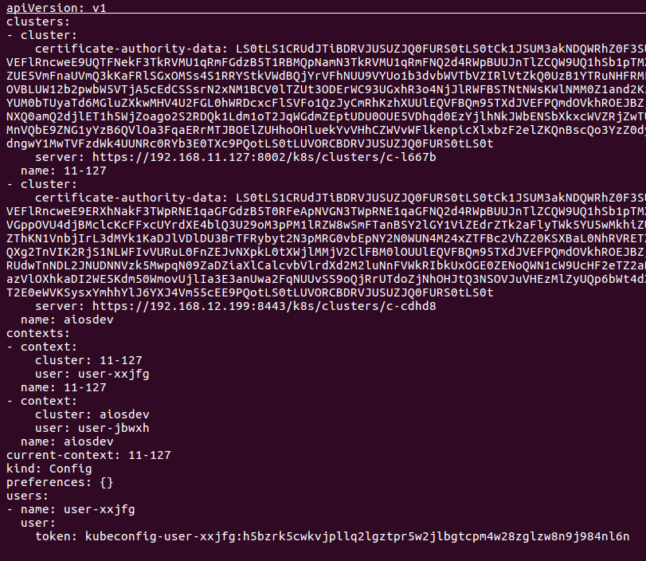

dockerFile:
  flask启动指定端口80，需要expose暴露该端口，然后docker run -p映射到宿主机端口

k8s网络：
    
    网络这一块要解决的问题是同一台宿主机的pod与pod,pod与宿主机的通信，不同宿主机的pod与pod, pod与其他宿主机的通信,与外部网络的双向通信。
   
    
    每个Pod会分配一个10.233.65.0/24网段的IP，每个服务又会分配一个10.233.10.24网段的clusterIP，ping service会解析到一个IP，
    因为是虚拟IP，不会回ping包。     
    k8s通过flannel插件, 增加了10.233网段,通过k8s创建的容器都属于这个网段
    同一个Pod中的容器会自动的分配到同一个node 上。同一个Pod中的容器共享资源、网络环境和依赖，它们总是被同时调度
    每个Pod都会被分配一个唯一的IP地址。Pod中的所有容器共享网络空间，包括IP地址和端口。Pod内部的容器可以使用localhost互相通信。
    一个pod有多个container, 每个container共用一个IP.Pod中的容器与外界通信时，必须分配共享网络资源（例如使用宿主机的端口映射）.
    在一个Kubernetes集群中可以使用namespace创建多个“虚拟集群”，这些namespace之间可以完全隔离，也可以通过某种方式，
    让一个namespace中的service可以访问到其他的namespace中的服务, 只有service才有endpoints
    
    由于Flannel、Weave都是overlay网络，均采用隧道方式，网络通信包传输过程中都有封包拆包处理，因此性能大打折扣；
    而Calico基于BGP路由方式实现，没有封包拆包和NAT，性能堪比物理机网络。Kubernetes的NetworkPolicy只支持对“入流量”（ingress）
    作限制，而Calico的网络策略作了更多的扩展，支持对“出流量”（egress）作限制，而且还具备更精细的规则控制，如协议、端口号、ICMP、源网段、目的网段等。
    
    
    docker的网络: 每个运行的docker都有一张虚拟的网卡(或者说虚拟接口), 该网卡分配的docker的子网IP. 所有的虚拟网卡通过docker0网桥连接在一起,从而互相通信.也能修改连接到其他网桥.
    网桥的基本功能是连接两个局域网网段,开始的网桥也就只有两个端口.交换机是网桥的替代,因为交换机的基本功能就是实现网桥.但是交换机还有很多高级的功能.
    veth 从名字上来看是 Virtual ETHernet 的缩写，它的作用很简单，就是要把从一个 network namespace 发出的数据包转发到另一个 namespace(namespace下可以是容器,主机网络).
    veth pair可以理解为网线连接好的两个接口，把两个端口放到两个namespace中，那么这两个namespace就能打通。如果要把namespace和本地网络打通，也可以创建veth设备，把两端分别放入本地和namespace 
    仅有veth-pair设备，容器是无法访问网络的,一端需要桥接在网桥(birdge)上才能互联. 可以使用ip link命令创建veth,然后给veth两端分别配置独立的ip. 
    docker运行时会使用宿主机的dns, 其配置文件/etc/resolve.conf会与宿主机的一致,但是k8s上使用kubedns等组件,所以会/etc/resolve.conf的配置
    会指向k8s上的dns服务器.但该dns服务器仍然会使用宿主机的配置以解析集群外的域名.
    
    同一主机上的容器间通信, 就是二层网络通信, 直接使用docker0这个交换机容器访问外部的网络,需要走路由,发给网关, 实质是snat, 
    外部网络访问容器内的服务,需要做端口映射,端口映射的实现是dnat.不同主机间的容器间通信: 有多种方案,主流的是使用flannel和calico等cni插件.
    docker0实现交换机功能,也提供网关,类似三层交换机k8s是容器编排系统,解决了分布式资源调度的问题,解决了容器间网络通信的问题

k8s API:

    每个API对象都有3大类属性：元数据metadata、规范spec和状态status。元数据是用来标识API对象的，每个对象都至少有3个元数据：
    namespace，name和uid；除此以外还有各种各样的标签labels用来标识和匹配不同的对象，例如用户可以用标签env来标识区分不同的服务
    部署环境，分别用env=dev、env=testing、env=production来标识开发、测试、生产的不同服务。规范描述了用户期望Kubernetes集群中
    的分布式系统达到的理想状态（Desired State），例如用户可以通过复制控制器Replication Controller设置期望的Pod副本数为3；
    status描述了系统实际当前达到的状态（Status），例如系统当前实际的Pod副本数为2；那么复制控制器当前的程序逻辑就是自动启动新的Pod，
    争取达到副本数为3。
    
    Kubernetes中所有的配置都是通过API对象的spec去设置的，所有的操作都是声明式而不是命令式的。声明式操作在分布式系统中的好处是稳定，
    不怕丢操作或运行多次，例如设置副本数为3的操作运行多次也还是一个结果，而给副本数加1的操作就不是声明式的，运行多次结果就错了。
    
    
    API Server 负责和etcd交互（其他组件不会直接操作etcd，都是通过API Server访问），是整个 kubernetes 集群的数据中心。
    API Server是集群内部各个模块之间通信的枢纽：所有模块之前并不会之间互相调用，而是通过和API Server打交道.
    kubelet 的主要功能就是定时从API Server获取节点上 pod/container 的期望状态，并调用对应的容器平台接口达到这个状态

k8s服务注册与发现：
    
    这里的服务是http，grpc,数据库服务等所有的应用层服务，注册指的是创建了service，发现是其他pod能够根据服务名来访问这个服务。
    服务最终能访问还是需要IP和端口，服务名和ip:port的对应的关系存储在etcd里面。 其他pod可以通过环境变量和dns解析去获取到对应关系，即服务发现。
    当然dns是更方便更智能的方式。
    
    其实微服务所谓的服务发现/name service不要被忽悠觉得是多神奇的东西，实质就是service name和address的对应关系，最简单的Nginx/Apache这些都能做（域名转向，proxy），
    或者你要写个name : address的对应关系到db里面也完全可以，再配一个定时healthcheck的服务，最简单的服务发现也就行了。微服务的开发并不是难点，难点是微服务的配置和部署
    
    k8s里面每个作为服务端的pod都提供了服务，可以是http服务也可以说rpc或数据库服务，集群内的其他pod要想访问该服务就要知道服务的ip和端口，但是pod会重启，重启后
    IP会变，所以使用service绑定pod，service的clusterip不变。 service就是k8s提供的微服务机制，service的创建就是服务注册，服务发现就是解析到服务的cluster ip.
    但是pod要访问服务还是要知道service的cluster ip，要部署后才知道,很不方便。 有环境变量和dns两种方式实现服务发现，
    一般是dns,没有dns,如果没有dns，直接用service name访问是没有响应的，因为解析不到IP。
    
    不直接用nodeport是不够安全，每个服务的端口都暴露出来，每个node都能访问，并且每增加一个外网可以访问的服务就需要指定一个nodeport，不方便管理
    所以使用ingress做统一管理，所有的服务都走到ingress，然后再分发，ingress实现使用nginx, 对外只提供一个ingress服务的ip,然后做七层负载均衡。
    每个node上都起一个nginx,流量进来之后直接走nginx做七层代理，然后走serviceip
    
    Service 除了提供稳定的对外访问方式之外，还能起到负载均衡（Load Balance）的功能.实现 service的是kube-proxy,运行在每个节点上，
    监听 API Server 中服务对象的变化，通过管理 iptables 来实现网络的转发。上面创建的服务只能在集群内部访问，
    如果希望有一个能直接对外使用的服务，可以使用 NodePort 或者 LoadBalancer 类型的 Service。nodePort 类型的服务会在所有的 worker
    节点（运行了 kube-proxy）上统一暴露出端口对外提供服务，也就是说外部可以任意选择一个节点进行访问,不仅仅是pod所运行的node.LoadBalancer 类型的服务需要公有云支持，如GCE、AWS。 
    
    
    
k8s存储：

    最简单的是使用docker的挂载方式volume,将本地或者分布式存储等挂载到某个目录,不够灵活.
    使用pvc的方式, pvc是用户向系统申请资源,k8s管理员事先提供对应的存储资源即可. 如果先创建了pvc,但是没有绑定pv,服务会起不来.
    但可以再接着创建pv,绑定后服务会正常运行.当然pvc也可以挂载到storage class.
    一个pvc只能挂载到一个pv,要实现数据共享,是多个pod挂载到一个pvc.挂载只在pod处设置,因为pod是真正运行的.
    如果底层存储出问题,pvc和pv都会看着正常,但是pod会运行失败,提示挂载失败. 这个时候要切换到新的pv是把原有的pv删除,pvc会重新匹配,但数据会丢失.
    如果是pvc没有指定selector,导致绑定出错,把pvc删除之后pv会出于释放状态,由于还保留着之前的数据，这些数据需要根据不同的策略来处理，否则这些pv无法被其他pvc使用。

k8s资源和调度：

    limits是上限，不能突破，但不保证能给。 requests是下限，保证能给。 举例说明：一个容器 requests.memory 512Mi，limits.memory 1Gi。
    宿主机内存使用量高时，一定会留512Mi内存给这个容器，不一定能拿到1Gi内存。宿主机内存使用量低时，容器不能突破1Gi内存。Gi和G的区别是Gi是1024进制，
    G是1000进制，M Mi也是同理。设置pvc的时候一定要注意单位G和Gi,不然可能不会bound。
    单位个cpu单位 m指千分之一，200m即0.2个cpu。这是绝对值，不是相对值。比如0.1CPU不管是在单核或者多核机器上都是一样的，都严格等于0.1CPU core
    
    namespace是用于资源隔离, cgroup是用于资源控制和隔离, 控制是限制每个容器的资源占用,避免不同容器间资源争抢
    
    可以指定调度器 
    
    
## 服务注册与发现
服务注册与发现， 服务名对应到提供服务的地址，但服务是要做到自动扩缩容，并实现负载均衡，这样就会要求服务列表是变化的，
服务列表变化后要能主动通知到上游的调用方

最简单的Nginx/Apache这些都能做（域名转向，proxy），或者你要写个name : address的对应关系到db里面也完全可以，再配一个定时healthcheck的服务，
最简单的服务发现也就行了。高级点用到zookeeper/etcd等等，或者SpringCloud全家桶，那只是简化配置，原理都一样

<分布式(一) 搞定服务注册与发现 > https://crossoverjie.top/2018/08/27/distributed/distributed-discovery-zk/

## kubectl

kubectl访问集群通过config文件中的认证信息进行认证，主要包含clusters, users, contexts三个字段，并且每个字段都是列表模式，支持配置多个。
往往会操作多个k8s集群，通过vi手动将不同集群的config信息放到同一个config文件，然后进行切换。

kubectl config use-context 11-127   进行切换

