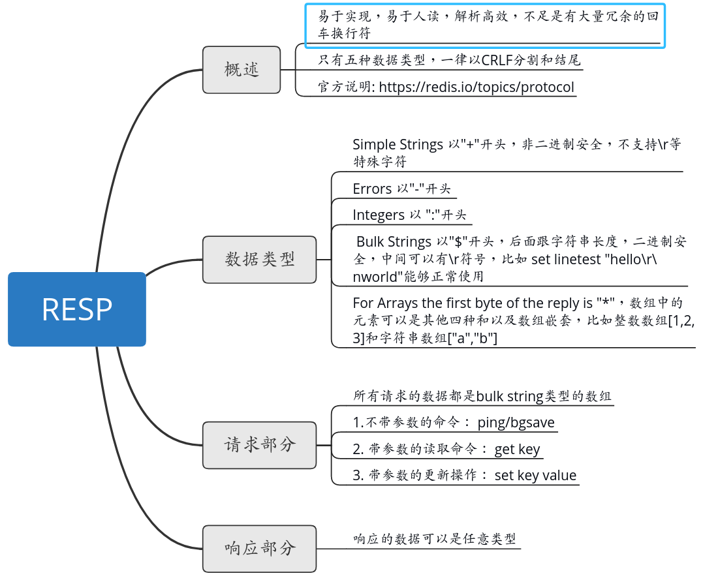

## redisy-py
官方推荐的访问redis的客户端https://redis.io/clients#python， 比较常用的是redis-py,项目地址https://github.com/andymccurdy/redis-py。

redis-py源码目录

    -_init_.py
    -_compact_.py (python 2.X版和 3.X版一些库/函数/方法的兼容）
    -client.py （redis客户端，实例一个StrictRedis或者Redis，就可以操作Redis Server）
    -connection.py（与Redis Server的联接，同时提供一个Redis连接池）
    -exceptions.py （定义的异常）
    -util.py （工具方法）
    redis-py的核心代码都在 connection.py和client.py。前一个与Redis Server联通，后一个是操作Redis Server。
    
redis-py提供两个类：StrictRedis和Redis，用于实现Redis的命令，推荐使用StrictRedis。StrictRedis实现了绝大部分官方的命令，
并且使用官方的语法和命令（比如，SET命令对应与StrictRedis.set方法）。Redis是StrictRedis的子类, Redis类是用来向后兼容旧版本的。

redis-py使用connection pool来管理对一个redis server的所有连接，避免每次建立、释放连接的开销。默认时，每个Redis实例都需要维护一个自己的连接池.
也可以通过ConnectionPool直接建立一个连接池，然后作为参数传递到Redis类进行覆盖，这样就可以实现多个 Redis 实例共享一个连接池资源。
意思是默认的话每实例化一个Redis类就会建一个连接池。redis-cli info可查看连接数。
 
<redis-py源码分析 进程安全线程安全 > https://www.zoulei.net/2016/08/06/redis_py_note/
<redispy 多进程使用> http://xiaorui.cc/2016/05/17/%e7%bb%99redis-py%e6%8f%90%e4%ba%a4pull-request%e5%bc%95%e8%b5%b7%e7%9a%84%e6%80%9d%e8%80%83/
<redispy 源码分析> https://www.jianshu.com/p/a79fc17ebdf4
 
## resp协议
redis客户端和服务端之间通信的协议是文本协议resp,分为五大类型，请求只使用到了多行字符串，响应用到了所有的。
redis-cli显示的时候会对resp做一定的解析，比如如果是数据就会在前面多显示(integer),错误就会加上(error)，响应本身是没有是redis-cli加上的。
 
resp协议总结：

 
<理解 Redis 的 RESP 协议> https://www.jianshu.com/p/c0c18f9f5494

## redis-py源码分析
源码阅读过程： 沿着实例化redis->redis.get()的代码分析即可, 如果直接用python自行实现redis访问，也只要实现命令打包，发送与解析即可。

    命令执行入口：Redis.execute_command
    命令打包： Connection.pack_command, 返回的是个数组，方便对大对象处理，如果超过6000字节就分割为多个chunk
    命令发送： Connection.send_command
    响应解析： Connection.read_response -> self._parser.read_response, 解析的时候先读取一行，判断所属类型，如果是多行字符串就会接着读，如果是数组就会递归的读

redis-py有两种解析响应内容的parser类，PythonParser和HiredisParser。如果已经安装了hiredis模块，redis-py会使用HiredisParser，否则使用PythonParser。
Hiredis是Redis数据库的简约C客户端库，使用它解析更高效简单，而PythonParser类中则需要自行实现resp的解析。
PythonParser类中的self._buffer是SocketBuffer实例，使用到了io.BytesIO(). 在Python里面，内存读写字符串用StringIO， 内存读写bytes用BytesIO，
操作方法跟打开一个磁盘文件的操作一样，有read, readline, write等操作。 StringIO和BytesIO是所有数据都会按写入顺序持续的存在内存里，
不会跟队列一样读取了就没了，所以读取和写入的时候要通过seek指定起始位置。

<hiredis官方介绍> https://pypi.org/project/hiredis/
 
## redis-py连接池
连接池里的connection不代表与server建立连接的，使用连接池中的connection时会先判断该连接是否可用，如果不可用就会去建立新的连接。

redis-py是多进程安全的，通过checkpid判断与初始pid是否一样，在新的进程下会重新初始化一个连接池。
也是线程安全的，在官方文档有提及，可以直接将redis连接实例设置为一个全局变量，get_connection是从可用队列pop出一个或者创建新的， list.pop的操作是线程安全的，所以没有用到锁。
由于线程安全原因，不提供select实现，因为它会导致数据库的切换，要切换数据库就得重新实例化Redis。在不同线程间传递PubSub or Pipeline对象也是不安全的

<python线程安全操作> http://effbot.org/pyfaq/what-kinds-of-global-value-mutation-are-thread-safe.htm 

 
## redis-py的分布式锁
lock.py实现了基于redis和lua脚本实现的分布式共享锁的接口，但是死锁等部分问题需要自行解决