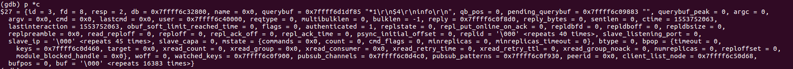

服务端命令的处理过程,参考
https://gitbook.cn/gitchat/column/5c0e149eedba1b683458fd5f/topic/5c0e2c27edba1b683459204d

## 命令执行过程
   1. redis的eventloop获取到读事件后，会一次读取16M的大小，一般能将客户端发送的所有数据读取完，然后根据RESP协议，依次解析到argc和argv进行执行，
   执行完之后将结果写入到发送buf里面，并有可能产生可写事件。
   如果命令读取不完整，最后一个命令会执行出错，即short read现象，什么时候会出现？怎么解决？ 这块没有弄懂
   2. 可写事件的处理方式：
     前提是所有的reply数据都是放在发送缓冲区，有三种方案
     (1)每个命令执行完之后直接发送;
     (2)注册可写事件，等下一次epoll_wait的时候处理。在一次处理中多个命令的reply只需要注册一个事件
     (3)将所有的client的命令都执行完之后统一在下一次eventloop之前处理，使用同步的方式，处理不完的再注册写事件
     redis3.0采用的方案2, 4.0之后采用方案3.
     
     
   之所以不注册监听可写事件，等可写事件触发再发送数据，原因是通常情况下，网络通信的两端数据一般都是正常收发的，不会出现某一端由于 Tcp 窗口太小而使另外一端发不出去的情况。
   如果注册监听可写事件，那么这个事件会频繁触发，而触发时不一定有数据需要发送，可能两次写事件连着一起发送出去了，这样不仅浪费系统资源，同时也浪费服务器程序宝贵的 CPU 时间片。
   而且可写事件一般不会阻塞，因为write只是写到缓冲区，发送到client由内核完成

   向客户端回复都是在networking.c/addReply()函数中，每个命令的实现中都会调用addReply()函数，在3.0和4.0的版本中addReply()函数的结构大致一样，
   但prepareClientToWrite(c)的实现不一样
   
### redis v3.0 
```
/* This function is called every time we are going to transmit new data
 * to the client. The behavior is the following:
 *
 * 这个函数在每次向客户端发送数据时都会被调用。函数的行为如下：
 *
 * If the client should receive new data (normal clients will) the function
 * returns REDIS_OK, and make sure to install the write handler in our event
 * loop so that when the socket is writable new data gets written.
 *
 * 当客户端可以接收新数据时（通常情况下都是这样），函数返回 REDIS_OK ，
 * 并将写处理器（write handler）安装到事件循环中，
 * 这样当套接字可写时，新数据就会被写入。
 *
 * If the client should not receive new data, because it is a fake client,
 * a master, a slave not yet online, or because the setup of the write handler
 * failed, the function returns REDIS_ERR.
 *
 * 对于那些不应该接收新数据的客户端，
 * 比如伪客户端、 master 以及 未 ONLINE 的 slave ，
 * 或者写处理器安装失败时，
 * 函数返回 REDIS_ERR 。
 *
 * Typically gets called every time a reply is built, before adding more
 * data to the clients output buffers. If the function returns REDIS_ERR no
 * data should be appended to the output buffers. 
 *
 * 通常在每个回复被创建时调用，如果函数返回 REDIS_ERR ，
 * 那么没有数据会被追加到输出缓冲区。
 */
int prepareClientToWrite(redisClient *c) {

    // LUA 脚本环境所使用的伪客户端总是可写的
    if (c->flags & REDIS_LUA_CLIENT) return REDIS_OK;
    
    // 客户端是主服务器并且不接受查询，
    // 那么它是不可写的，出错
    if ((c->flags & REDIS_MASTER) &&
        !(c->flags & REDIS_MASTER_FORCE_REPLY)) return REDIS_ERR;

    // 无连接的伪客户端总是不可写的
    if (c->fd <= 0) return REDIS_ERR; /* Fake client */

    // 一般情况，为客户端套接字安装写处理器到事件循环
    if (c->bufpos == 0 && listLength(c->reply) == 0 &&
        (c->replstate == REDIS_REPL_NONE ||
         c->replstate == REDIS_REPL_ONLINE) &&
        aeCreateFileEvent(server.el, c->fd, AE_WRITABLE,
        sendReplyToClient, c) == AE_ERR) return REDIS_ERR;

    return REDIS_OK;
}
```
   
   
### redis v5.0
  ```
/* This function is called every time we are going to transmit new data
 * to the client. The behavior is the following:
 *
 * If the client should receive new data (normal clients will) the function
 * returns C_OK, and make sure to install the write handler in our event
 * loop so that when the socket is writable new data gets written.
 *
 * If the client should not receive new data, because it is a fake client
 * (used to load AOF in memory), a master or because the setup of the write
 * handler failed, the function returns C_ERR.
 *
 * The function may return C_OK without actually installing the write
 * event handler in the following cases:
 *
 * 1) The event handler should already be installed since the output buffer
 *    already contains something.
 * 2) The client is a slave but not yet online, so we want to just accumulate
 *    writes in the buffer but not actually sending them yet.
 *
 * Typically gets called every time a reply is built, before adding more
 * data to the clients output buffers. If the function returns C_ERR no
 * data should be appended to the output buffers. */
int prepareClientToWrite(client *c) {
    /* If it's the Lua client we always return ok without installing any
     * handler since there is no socket at all. */
    if (c->flags & (CLIENT_LUA|CLIENT_MODULE)) return C_OK;

    /* CLIENT REPLY OFF / SKIP handling: don't send replies. */
    if (c->flags & (CLIENT_REPLY_OFF|CLIENT_REPLY_SKIP)) return C_ERR;

    /* Masters don't receive replies, unless CLIENT_MASTER_FORCE_REPLY flag
     * is set. */
    if ((c->flags & CLIENT_MASTER) &&
        !(c->flags & CLIENT_MASTER_FORCE_REPLY)) return C_ERR;

    if (c->fd <= 0) return C_ERR; /* Fake client for AOF loading. */

    /* Schedule the client to write the output buffers to the socket, unless
     * it should already be setup to do so (it has already pending data). */
    if (!clientHasPendingReplies(c)) clientInstallWriteHandler(c);

    /* Authorize the caller to queue in the output buffer of this client. */
    return C_OK;
}
```
clientHasPendingReplies(c)通过判断client对象的bufpos字段(int型)和reply字段(这是一个链表)的长度是否大于0判断发送缓冲区中
是否还有未发送的应答命令。其中clientInstallWriteHandler(c)将需要发送数据的client加入到队列.
如果当前client对象不是处于CLIENT_PENDING_WRITE状态，且在发送缓冲区没有剩余数据，则给该client对象设置CLIENT_PENDING_WRITE标志，
并将当前client对象添加到全局server对象的名叫clients_pending_write链表中去。这个链表中存的是所有有数据要发送的client对象，
要发送的数据通过networking.c/_addReplyToBuffer()函数拷贝到client对应的发送缓冲区中。
然后会在server.c/beforeSleep()函数中调用handleClientsWithPendingWrites将所有客户端要发发送的数据一次性处理完。
如果因为缓冲区满等原因导致没有完全发送出去，则会注册一个写的事件下次eventloop之后接着写。 
_addReplyToBuffer函数会尝试将命令结果放入输出缓冲(c->buf)中，如果不成功(c-reply中有内容，或者超过缓冲大小)，会调用_addReplyObjectToList函数放入c->reply链表中。
```
/* This function is called just before entering the event loop, in the hope
 * we can just write the replies to the client output buffer without any
 * need to use a syscall in order to install the writable event handler,
 * get it called, and so forth. */
int handleClientsWithPendingWrites(void) {
    listIter li;
    listNode *ln;
    int processed = listLength(server.clients_pending_write);

    listRewind(server.clients_pending_write,&li);
    while((ln = listNext(&li))) {
        client *c = listNodeValue(ln);
        c->flags &= ~CLIENT_PENDING_WRITE;
        listDelNode(server.clients_pending_write,ln);

        /* If a client is protected, don't do anything,
         * that may trigger write error or recreate handler. */
        if (c->flags & CLIENT_PROTECTED) continue;

        /* Try to write buffers to the client socket. */
        if (writeToClient(c->fd,c,0) == C_ERR) continue;

        /* If after the synchronous writes above we still have data to
         * output to the client, we need to install the writable handler. */
        if (clientHasPendingReplies(c)) {
            int ae_flags = AE_WRITABLE;
            /* For the fsync=always policy, we want that a given FD is never
             * served for reading and writing in the same event loop iteration,
             * so that in the middle of receiving the query, and serving it
             * to the client, we'll call beforeSleep() that will do the
             * actual fsync of AOF to disk. AE_BARRIER ensures that. */
            if (server.aof_state == AOF_ON &&
                server.aof_fsync == AOF_FSYNC_ALWAYS)
            {
                ae_flags |= AE_BARRIER;
            }
            if (aeCreateFileEvent(server.el, c->fd, ae_flags,
                sendReplyToClient, c) == AE_ERR)
            {
                    freeClientAsync(c);
            }
        }
    }
    return processed;
}
```


## gdb
gdb启动服务端，在readQueryFromClient处断点查看执行过程，接收到client端的info指令后的情况，
 
调试过程，client端没有收到回复，界面上会一直阻塞，当调试到命令处理结束之后info才有显示
   
   
  
  
  
