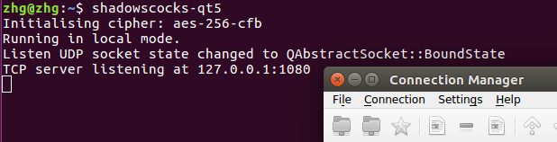
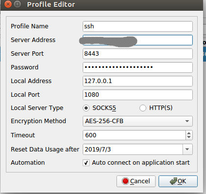

## 概述
  在亚马逊或者其他云服务商申请一台vps,ssh到vps后在服务器上安装shadowsocks服务端，在本机电脑安装shadowsocks客户端，
  本机的客户端就提供了一个代理，通过此代理流量会走到vps然后再出去。要fq的话还需要在浏览器比如chrome上安装Proxy SwitchyOmega插件，
  这个插件是用于设置访问哪些网站需要走代理，那么这里的代理是本机的shadowsocks客户端。本机的shadowsocks还可以提供给局域网内其他人用，
  就可以实现共享。

 
vps搭建过程：
1.申请一台vps，亚马逊和谷歌都有一年的免费期，另外heroku提供免费版的,限制稍多
 https://blog.csdn.net/f59130/article/details/74014415
 http://blog.sina.com.cn/s/blog_67de9c540102uxk3.html
 
2.通过pem方式ssh到服务器进行配置
ssh -i "aws-unbuntu-1.pem" ubuntu@ec2xx-xx-xx.us-east-2.compute.amazonaws.com，

3.安装shadowsocks服务端

    pip install shadowsocks 
    
 创建配置文件
 
     mkdir /etc/shadowsocks
     vim /etc/shadowsocks/ss.json
 
 配置文件内容：
 
     {
         "server":"0.0.0.0",
         "server_port":443,
         "local_address":"127.0.0.1",
         "local_port":1080,
         "password":"www.jianshu.com/u/e02df63eaa87",
         "timeout":300,
         "method":"aes-256-cfb",
         "fast_open":false,
         "workers": 1
     }
     配置字段     说明
     server     服务端监听地址(IPv4或IPv6)
     server_port     服务端端口，一般为443
     local_address     本地监听地址，缺省为127.0.0.1
     local_port     本地监听端口，一般为1080
     password     用以加密的密匙
     timeout     超时时间（秒）
     method     加密方法，默认为aes-256-cfb，更多请查阅Encryption
     fast_open     是否启用TCP-Fast-Open，true或者false
     workers     worker数量
 
 启动Shadowsocks
 
     启动：ssserver -c /etc/shadowsocks/ss.json -d start
     停止：ssserver -c /etc/shadowsocks/ss.json -d stop
     重启：ssserver -c /etc/shadowsocks/ss.json -d restart
     
 设置SS为开机自启动
    
    vi /etc/rc.local
    sudo ssserver -c /etc/shadowsocks/ss.json -d start

4.安装客户端
 从github上下载安装文件，安装后启动命令shadowscocks-qt5， 启动后的界面为
 打开配置，如下,主要配置好服务端所在的公网IP以及密码
 
 
 安装Proxy SwitchyOmega插件，配置好代理方式，要fq的时候启动所有的
 

youtube视频下载插件
https://addoncrop.com/youtube_video_downloader/